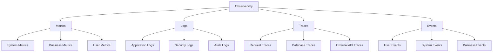

# Akashic Intelligence - Monitoring & Analytics Documentation

## Overview

This document outlines the comprehensive monitoring, observability, and analytics strategy for the Akashic Intelligence Campaign Console platform, ensuring system reliability, performance optimization, and actionable insights.

## Table of Contents

1. [Monitoring Strategy](#monitoring-strategy)
2. [Infrastructure Monitoring](#infrastructure-monitoring)
3. [Application Performance Monitoring](#application-performance-monitoring)
4. [Log Management](#log-management)
5. [Real-time Analytics](#real-time-analytics)
6. [Business Intelligence](#business-intelligence)
7. [Alerting & Incident Management](#alerting--incident-management)
8. [Performance Optimization](#performance-optimization)
9. [Capacity Planning](#capacity-planning)
10. [Reporting & Dashboards](#reporting--dashboards)

---

## Monitoring Strategy

### Observability Pillars



### Monitoring Levels

1. **Infrastructure Layer**: Hardware, network, OS-level metrics
2. **Platform Layer**: Kubernetes, containers, orchestration
3. **Application Layer**: Application performance, errors, latency
4. **Business Layer**: User engagement, campaign effectiveness, revenue
5. **Security Layer**: Threats, vulnerabilities, compliance

### Key Performance Indicators (KPIs)

```typescript
// lib/monitoring/kpis.ts
export interface SystemKPIs {
  // Infrastructure KPIs
  systemAvailability: number      // 99.9% target
  responseTime: number           // <200ms average
  errorRate: number              // <0.1% target
  throughput: number             // requests/second
  
  // Application KPIs
  messageGenerationTime: number  // <5s average
  userSatisfactionScore: number  // >4.5/5 target
  featureAdoptionRate: number    // >70% target
  apiSuccessRate: number         // >99.5% target
  
  // Business KPIs
  activeUsers: number            // Daily/Monthly active users
  campaignRetention: number      // Campaign retention rate
  revenuePerUser: number         // Average revenue per user
  conversionRate: number         // Trial to paid conversion
  
  // Security KPIs
  securityIncidents: number      // <1 per month
  vulnerabilityCount: number     // Critical: 0, High: <5
  complianceScore: number        // >95% target
  dataBreaches: number           // 0 target
}

export class KPITracker {
  async calculateKPIs(timeframe: TimeFrame): Promise<SystemKPIs> {
    const [infrastructure, application, business, security] = await Promise.all([
      this.calculateInfrastructureKPIs(timeframe),
      this.calculateApplicationKPIs(timeframe),
      this.calculateBusinessKPIs(timeframe),
      this.calculateSecurityKPIs(timeframe)
    ])

    return {
      ...infrastructure,
      ...application,
      ...business,
      ...security
    }
  }

  async trackKPITrends(): Promise<KPITrends> {
    const periods = ['7d', '30d', '90d'] as const
    
    const trends = await Promise.all(
      periods.map(async (period) => ({
        period,
        kpis: await this.calculateKPIs({ period }),
        comparison: await this.compareWithPrevious(period)
      }))
    )

    return {
      current: trends[0],
      shortTerm: trends[1],
      longTerm: trends[2],
      alerts: this.generateKPIAlerts(trends)
    }
  }
}
```

---

## Infrastructure Monitoring

### Prometheus Configuration

```yaml
# prometheus/prometheus.yml
global:
  scrape_interval: 15s
  evaluation_interval: 15s

rule_files:
  - "alert_rules.yml"
  - "recording_rules.yml"

scrape_configs:
  - job_name: 'akashic-app'
    static_configs:
      - targets: ['app:3000']
    metrics_path: '/api/metrics'
    scrape_interval: 5s
    
  - job_name: 'postgres'
    static_configs:
      - targets: ['postgres-exporter:9187']
    
  - job_name: 'redis'
    static_configs:
      - targets: ['redis-exporter:9121']
    
  - job_name: 'nginx'
    static_configs:
      - targets: ['nginx-exporter:9113']
    
  - job_name: 'node'
    static_configs:
      - targets: ['node-exporter:9100']

alerting:
  alertmanagers:
    - static_configs:
        - targets:
          - alertmanager:9093
```

### Custom Metrics Implementation

```typescript
// lib/monitoring/metrics.ts
import { Registry, Counter, Histogram, Gauge } from 'prom-client'

export class MetricsService {
  private registry: Registry
  
  // Request metrics
  private httpRequests: Counter
  private httpDuration: Histogram
  private httpErrors: Counter
  
  // Business metrics
  private messagesGenerated: Counter
  private campaignsCreated: Counter
  private userRegistrations: Counter
  private aiRequestDuration: Histogram
  
  // System metrics
  private activeUsers: Gauge
  private databaseConnections: Gauge
  private cacheHitRate: Gauge
  private queueSize: Gauge

  constructor() {
    this.registry = new Registry()
    this.setupMetrics()
  }

  private setupMetrics(): void {
    // HTTP Request metrics
    this.httpRequests = new Counter({
      name: 'http_requests_total',
      help: 'Total number of HTTP requests',
      labelNames: ['method', 'route', 'status_code'],
      registers: [this.registry]
    })

    this.httpDuration = new Histogram({
      name: 'http_request_duration_seconds',
      help: 'Duration of HTTP requests in seconds',
      labelNames: ['method', 'route'],
      buckets: [0.1, 0.3, 0.5, 0.7, 1, 3, 5, 7, 10],
      registers: [this.registry]
    })

    this.httpErrors = new Counter({
      name: 'http_errors_total',
      help: 'Total number of HTTP errors',
      labelNames: ['method', 'route', 'error_type'],
      registers: [this.registry]
    })

    // Business metrics
    this.messagesGenerated = new Counter({
      name: 'messages_generated_total',
      help: 'Total number of messages generated',
      labelNames: ['campaign_id', 'message_type', 'model'],
      registers: [this.registry]
    })

    this.campaignsCreated = new Counter({
      name: 'campaigns_created_total',
      help: 'Total number of campaigns created',
      labelNames: ['campaign_type', 'state'],
      registers: [this.registry]
    })

    this.aiRequestDuration = new Histogram({
      name: 'ai_request_duration_seconds',
      help: 'Duration of AI API requests',
      labelNames: ['provider', 'model', 'operation'],
      buckets: [1, 2, 5, 10, 15, 30, 60],
      registers: [this.registry]
    })

    // System metrics
    this.activeUsers = new Gauge({
      name: 'active_users',
      help: 'Number of currently active users',
      registers: [this.registry]
    })

    this.databaseConnections = new Gauge({
      name: 'database_connections',
      help: 'Number of active database connections',
      registers: [this.registry]
    })

    this.cacheHitRate = new Gauge({
      name: 'cache_hit_rate',
      help: 'Cache hit rate percentage',
      registers: [this.registry]
    })
  }

  // Metric recording methods
  recordHttpRequest(method: string, route: string, statusCode: number, duration: number): void {
    this.httpRequests.inc({ method, route, status_code: statusCode.toString() })
    this.httpDuration.observe({ method, route }, duration)
    
    if (statusCode >= 400) {
      const errorType = statusCode >= 500 ? 'server_error' : 'client_error'
      this.httpErrors.inc({ method, route, error_type: errorType })
    }
  }

  recordMessageGeneration(campaignId: string, messageType: string, model: string): void {
    this.messagesGenerated.inc({ campaign_id: campaignId, message_type: messageType, model })
  }

  recordAIRequest(provider: string, model: string, operation: string, duration: number): void {
    this.aiRequestDuration.observe({ provider, model, operation }, duration)
  }

  updateActiveUsers(count: number): void {
    this.activeUsers.set(count)
  }

  updateCacheHitRate(rate: number): void {
    this.cacheHitRate.set(rate)
  }

  async getMetrics(): Promise<string> {
    return await this.registry.metrics()
  }
}

// Express middleware for automatic HTTP metrics
export function metricsMiddleware(metrics: MetricsService) {
  return (req: Request, res: Response, next: NextFunction) => {
    const startTime = Date.now()
    
    res.on('finish', () => {
      const duration = (Date.now() - startTime) / 1000
      metrics.recordHttpRequest(
        req.method,
        req.route?.path || req.path,
        res.statusCode,
        duration
      )
    })
    
    next()
  }
}
```

### Alert Rules

```yaml
# prometheus/alert_rules.yml
groups:
  - name: infrastructure
    rules:
      - alert: HighCPUUsage
        expr: cpu_usage_percent > 80
        for: 5m
        labels:
          severity: warning
        annotations:
          summary: "High CPU usage detected"
          description: "CPU usage is above 80% for more than 5 minutes"

      - alert: HighMemoryUsage
        expr: memory_usage_percent > 85
        for: 5m
        labels:
          severity: warning
        annotations:
          summary: "High memory usage detected"
          description: "Memory usage is above 85% for more than 5 minutes"

      - alert: DiskSpaceLow
        expr: disk_free_percent < 10
        for: 2m
        labels:
          severity: critical
        annotations:
          summary: "Low disk space"
          description: "Disk space is below 10%"

  - name: application
    rules:
      - alert: HighErrorRate
        expr: rate(http_errors_total[5m]) > 0.1
        for: 2m
        labels:
          severity: critical
        annotations:
          summary: "High error rate detected"
          description: "Error rate is above 10% for more than 2 minutes"

      - alert: SlowResponseTime
        expr: histogram_quantile(0.95, rate(http_request_duration_seconds_bucket[5m])) > 2
        for: 5m
        labels:
          severity: warning
        annotations:
          summary: "Slow response times"
          description: "95th percentile response time is above 2 seconds"

      - alert: DatabaseConnectionsHigh
        expr: database_connections > 80
        for: 3m
        labels:
          severity: warning
        annotations:
          summary: "High database connections"
          description: "Database connections are above 80"

  - name: business
    rules:
      - alert: LowMessageGenerationRate
        expr: rate(messages_generated_total[1h]) < 10
        for: 30m
        labels:
          severity: warning
        annotations:
          summary: "Low message generation rate"
          description: "Message generation rate is below normal"

      - alert: HighAIRequestFailures
        expr: rate(ai_request_failures_total[5m]) > 0.05
        for: 3m
        labels:
          severity: critical
        annotations:
          summary: "High AI request failures"
          description: "AI request failure rate is above 5%"

  - name: security
    rules:
      - alert: MultipleFailedLogins
        expr: rate(security_failed_logins_total[5m]) > 10
        for: 1m
        labels:
          severity: warning
        annotations:
          summary: "Multiple failed login attempts"
          description: "More than 10 failed login attempts in 5 minutes"

      - alert: SecurityIncident
        expr: increase(security_events_total{severity="critical"}[5m]) > 0
        for: 0m
        labels:
          severity: critical
        annotations:
          summary: "Critical security event detected"
          description: "A critical security event has been detected"
```

---

## Application Performance Monitoring

### OpenTelemetry Integration

```typescript
// lib/monitoring/tracing.ts
import { NodeSDK } from '@opentelemetry/sdk-node'
import { Resource } from '@opentelemetry/resources'
import { SemanticResourceAttributes } from '@opentelemetry/semantic-conventions'
import { JaegerExporter } from '@opentelemetry/exporter-jaeger'
import { PeriodicExportingMetricReader } from '@opentelemetry/sdk-metrics'
import { PrometheusExporter } from '@opentelemetry/exporter-prometheus'

export class TracingService {
  private sdk: NodeSDK

  constructor() {
    this.sdk = new NodeSDK({
      resource: new Resource({
        [SemanticResourceAttributes.SERVICE_NAME]: 'akashic-intelligence',
        [SemanticResourceAttributes.SERVICE_VERSION]: process.env.APP_VERSION || '1.0.0',
        [SemanticResourceAttributes.DEPLOYMENT_ENVIRONMENT]: process.env.NODE_ENV || 'development'
      }),
      traceExporter: new JaegerExporter({
        endpoint: process.env.JAEGER_ENDPOINT || 'http://jaeger:14268/api/traces'
      }),
      metricReader: new PeriodicExportingMetricReader({
        exporter: new PrometheusExporter({
          port: 9464,
          endpoint: '/metrics'
        }),
        exportIntervalMillis: 1000
      }),
      instrumentations: [
        // Auto-instrumentation for common libraries
        getNodeAutoInstrumentations({
          '@opentelemetry/instrumentation-http': {
            enabled: true,
            ignoreOutgoingUrls: ['/health', '/metrics']
          },
          '@opentelemetry/instrumentation-express': {
            enabled: true
          },
          '@opentelemetry/instrumentation-prisma': {
            enabled: true
          },
          '@opentelemetry/instrumentation-redis': {
            enabled: true
          }
        })
      ]
    })
  }

  start(): void {
    this.sdk.start()
    console.log('Tracing initialized successfully')
  }

  shutdown(): Promise<void> {
    return this.sdk.shutdown()
  }
}

// Custom instrumentation for AI operations
export class AITracing {
  private tracer = trace.getTracer('akashic-ai')

  async traceMessageGeneration<T>(
    operation: string,
    campaignId: string,
    messageType: string,
    fn: () => Promise<T>
  ): Promise<T> {
    return await this.tracer.startActiveSpan(
      `ai.message.${operation}`,
      {
        attributes: {
          'ai.operation': operation,
          'campaign.id': campaignId,
          'message.type': messageType,
          'ai.provider': 'openai',
          'ai.model': 'gpt-4'
        }
      },
      async (span) => {
        try {
          const result = await fn()
          
          span.setAttributes({
            'ai.success': true,
            'message.length': typeof result === 'object' && 'content' in result 
              ? (result.content as string).length : 0
          })
          
          span.setStatus({ code: SpanStatusCode.OK })
          return result
        } catch (error) {
          span.setAttributes({
            'ai.success': false,
            'error.message': error.message
          })
          
          span.setStatus({
            code: SpanStatusCode.ERROR,
            message: error.message
          })
          
          throw error
        } finally {
          span.end()
        }
      }
    )
  }

  async traceRiskAnalysis<T>(
    content: string,
    fn: () => Promise<T>
  ): Promise<T> {
    return await this.tracer.startActiveSpan(
      'ai.risk.analysis',
      {
        attributes: {
          'ai.operation': 'risk_analysis',
          'content.length': content.length,
          'ai.provider': 'openai',
          'ai.model': 'gpt-4'
        }
      },
      async (span) => {
        try {
          const result = await fn()
          
          if (typeof result === 'object' && 'riskScore' in result) {
            span.setAttributes({
              'risk.score': result.riskScore as number,
              'risk.flags_count': Array.isArray((result as any).flags) 
                ? (result as any).flags.length : 0
            })
          }
          
          span.setStatus({ code: SpanStatusCode.OK })
          return result
        } catch (error) {
          span.setStatus({
            code: SpanStatusCode.ERROR,
            message: error.message
          })
          throw error
        } finally {
          span.end()
        }
      }
    )
  }
}
```

### Performance Profiling

```typescript
// lib/monitoring/profiling.ts
import * as profiler from '@google-cloud/profiler'

export class PerformanceProfiler {
  private enabled: boolean = process.env.PROFILING_ENABLED === 'true'

  async initialize(): Promise<void> {
    if (!this.enabled) return

    try {
      await profiler.start({
        serviceContext: {
          service: 'akashic-intelligence',
          version: process.env.APP_VERSION || '1.0.0'
        },
        projectId: process.env.GOOGLE_CLOUD_PROJECT_ID
      })
      
      console.log('Performance profiling initialized')
    } catch (error) {
      console.error('Failed to initialize profiling:', error)
    }
  }

  // Custom profiling for specific operations
  async profileOperation<T>(
    operationName: string,
    operation: () => Promise<T>
  ): Promise<T> {
    const startTime = process.hrtime.bigint()
    const startMemory = process.memoryUsage()

    try {
      const result = await operation()
      
      const endTime = process.hrtime.bigint()
      const endMemory = process.memoryUsage()
      
      const duration = Number(endTime - startTime) / 1000000 // Convert to milliseconds
      const memoryDelta = {
        rss: endMemory.rss - startMemory.rss,
        heapUsed: endMemory.heapUsed - startMemory.heapUsed,
        heapTotal: endMemory.heapTotal - startMemory.heapTotal
      }

      // Log performance metrics
      console.log(`Performance [${operationName}]:`, {
        duration: `${duration.toFixed(2)}ms`,
        memoryDelta: {
          rss: `${(memoryDelta.rss / 1024 / 1024).toFixed(2)}MB`,
          heapUsed: `${(memoryDelta.heapUsed / 1024 / 1024).toFixed(2)}MB`,
          heapTotal: `${(memoryDelta.heapTotal / 1024 / 1024).toFixed(2)}MB`
        }
      })

      // Record metrics
      if (duration > 1000) { // Alert on operations taking more than 1 second
        console.warn(`Slow operation detected: ${operationName} took ${duration.toFixed(2)}ms`)
      }

      return result
    } catch (error) {
      console.error(`Operation failed: ${operationName}`, error)
      throw error
    }
  }

  // Memory leak detection
  monitorMemoryUsage(): void {
    setInterval(() => {
      const usage = process.memoryUsage()
      const formatted = {
        rss: `${(usage.rss / 1024 / 1024).toFixed(2)}MB`,
        heapUsed: `${(usage.heapUsed / 1024 / 1024).toFixed(2)}MB`,
        heapTotal: `${(usage.heapTotal / 1024 / 1024).toFixed(2)}MB`,
        external: `${(usage.external / 1024 / 1024).toFixed(2)}MB`
      }

      // Alert on memory usage spikes
      if (usage.heapUsed > 500 * 1024 * 1024) { // 500MB
        console.warn('High memory usage detected:', formatted)
      }

      // Log memory usage for monitoring
      console.log('Memory usage:', formatted)
    }, 60000) // Every minute
  }
}
```

---

## Log Management

### Structured Logging

```typescript
// lib/monitoring/logging.ts
import winston from 'winston'
import { ElasticsearchTransport } from 'winston-elasticsearch'

export interface LogContext {
  userId?: string
  campaignId?: string
  sessionId?: string
  requestId?: string
  ip?: string
  userAgent?: string
  [key: string]: any
}

export enum LogLevel {
  ERROR = 'error',
  WARN = 'warn',
  INFO = 'info',
  DEBUG = 'debug'
}

export class Logger {
  private winston: winston.Logger

  constructor() {
    this.winston = winston.createLogger({
      level: process.env.LOG_LEVEL || 'info',
      format: winston.format.combine(
        winston.format.timestamp(),
        winston.format.errors({ stack: true }),
        winston.format.json(),
        winston.format.printf(({ timestamp, level, message, ...meta }) => {
          return JSON.stringify({
            timestamp,
            level,
            message,
            ...meta
          })
        })
      ),
      defaultMeta: {
        service: 'akashic-intelligence',
        version: process.env.APP_VERSION || '1.0.0',
        environment: process.env.NODE_ENV || 'development'
      },
      transports: [
        // Console transport for development
        new winston.transports.Console({
          format: winston.format.combine(
            winston.format.colorize(),
            winston.format.simple()
          )
        }),
        
        // File transport for production
        new winston.transports.File({
          filename: 'logs/error.log',
          level: 'error',
          maxsize: 5242880, // 5MB
          maxFiles: 5
        }),
        
        new winston.transports.File({
          filename: 'logs/combined.log',
          maxsize: 5242880, // 5MB
          maxFiles: 5
        })
      ]
    })

    // Add Elasticsearch transport for production
    if (process.env.NODE_ENV === 'production' && process.env.ELASTICSEARCH_URL) {
      this.winston.add(new ElasticsearchTransport({
        level: 'info',
        clientOpts: {
          node: process.env.ELASTICSEARCH_URL,
          auth: {
            username: process.env.ELASTICSEARCH_USERNAME!,
            password: process.env.ELASTICSEARCH_PASSWORD!
          }
        },
        index: 'akashic-logs',
        indexTemplate: {
          name: 'akashic-logs',
          body: {
            index_patterns: ['akashic-logs-*'],
            settings: {
              number_of_shards: 1,
              number_of_replicas: 1
            },
            mappings: {
              properties: {
                '@timestamp': { type: 'date' },
                level: { type: 'keyword' },
                message: { type: 'text' },
                userId: { type: 'keyword' },
                campaignId: { type: 'keyword' },
                sessionId: { type: 'keyword' },
                requestId: { type: 'keyword' },
                ip: { type: 'ip' },
                userAgent: { type: 'text' }
              }
            }
          }
        }
      }))
    }
  }

  info(message: string, context?: LogContext): void {
    this.winston.info(message, context)
  }

  warn(message: string, context?: LogContext): void {
    this.winston.warn(message, context)
  }

  error(message: string, error?: Error, context?: LogContext): void {
    this.winston.error(message, {
      error: error ? {
        name: error.name,
        message: error.message,
        stack: error.stack
      } : undefined,
      ...context
    })
  }

  debug(message: string, context?: LogContext): void {
    this.winston.debug(message, context)
  }

  // Specialized logging methods
  logUserAction(action: string, userId: string, details?: any): void {
    this.info(`User action: ${action}`, {
      userId,
      action,
      details,
      category: 'user_action'
    })
  }

  logSecurityEvent(event: string, severity: string, details?: any): void {
    this.warn(`Security event: ${event}`, {
      event,
      severity,
      details,
      category: 'security'
    })
  }

  logBusinessEvent(event: string, details?: any): void {
    this.info(`Business event: ${event}`, {
      event,
      details,
      category: 'business'
    })
  }

  logAPICall(method: string, url: string, statusCode: number, duration: number, context?: LogContext): void {
    this.info(`API call: ${method} ${url}`, {
      method,
      url,
      statusCode,
      duration,
      category: 'api',
      ...context
    })
  }

  logAIRequest(provider: string, model: string, operation: string, duration: number, success: boolean): void {
    this.info(`AI request: ${provider}/${model}/${operation}`, {
      provider,
      model,
      operation,
      duration,
      success,
      category: 'ai'
    })
  }
}

// Singleton logger instance
export const logger = new Logger()

// Express middleware for request logging
export function requestLoggingMiddleware(req: Request, res: Response, next: NextFunction): void {
  const startTime = Date.now()
  const requestId = Math.random().toString(36).substring(7)
  
  // Add request ID to headers
  res.setHeader('X-Request-ID', requestId)
  
  // Log request start
  logger.info('Request started', {
    requestId,
    method: req.method,
    url: req.url,
    ip: req.ip,
    userAgent: req.get('User-Agent'),
    category: 'request'
  })

  res.on('finish', () => {
    const duration = Date.now() - startTime
    
    logger.logAPICall(
      req.method,
      req.url,
      res.statusCode,
      duration,
      {
        requestId,
        ip: req.ip,
        userAgent: req.get('User-Agent')
      }
    )
  })

  next()
}
```

### Log Analysis & Querying

```typescript
// lib/monitoring/log-analysis.ts
export class LogAnalyzer {
  private elasticsearch: Client

  constructor() {
    this.elasticsearch = new Client({
      node: process.env.ELASTICSEARCH_URL,
      auth: {
        username: process.env.ELASTICSEARCH_USERNAME!,
        password: process.env.ELASTICSEARCH_PASSWORD!
      }
    })
  }

  async searchLogs(query: LogSearchQuery): Promise<LogSearchResult> {
    const searchBody = this.buildSearchQuery(query)
    
    const response = await this.elasticsearch.search({
      index: 'akashic-logs-*',
      body: searchBody
    })

    return {
      total: response.body.hits.total.value,
      logs: response.body.hits.hits.map((hit: any) => hit._source),
      aggregations: response.body.aggregations
    }
  }

  async getErrorTrends(timeframe: string): Promise<ErrorTrends> {
    const response = await this.elasticsearch.search({
      index: 'akashic-logs-*',
      body: {
        query: {
          bool: {
            must: [
              { term: { level: 'error' } },
              {
                range: {
                  '@timestamp': {
                    gte: `now-${timeframe}`
                  }
                }
              }
            ]
          }
        },
        aggs: {
          errors_over_time: {
            date_histogram: {
              field: '@timestamp',
              calendar_interval: '1h'
            }
          },
          error_types: {
            terms: {
              field: 'error.name.keyword',
              size: 10
            }
          },
          top_error_messages: {
            terms: {
              field: 'error.message.keyword',
              size: 10
            }
          }
        },
        size: 0
      }
    })

    return {
      timeline: response.body.aggregations.errors_over_time.buckets,
      errorTypes: response.body.aggregations.error_types.buckets,
      topMessages: response.body.aggregations.top_error_messages.buckets
    }
  }

  async getUserActivityAnalysis(userId: string, days: number = 7): Promise<UserActivity> {
    const response = await this.elasticsearch.search({
      index: 'akashic-logs-*',
      body: {
        query: {
          bool: {
            must: [
              { term: { userId } },
              { term: { category: 'user_action' } },
              {
                range: {
                  '@timestamp': {
                    gte: `now-${days}d`
                  }
                }
              }
            ]
          }
        },
        aggs: {
          actions_by_day: {
            date_histogram: {
              field: '@timestamp',
              calendar_interval: '1d'
            }
          },
          action_types: {
            terms: {
              field: 'action.keyword',
              size: 20
            }
          }
        },
        sort: [
          { '@timestamp': { order: 'desc' } }
        ],
        size: 100
      }
    })

    return {
      totalActions: response.body.hits.total.value,
      dailyActivity: response.body.aggregations.actions_by_day.buckets,
      actionBreakdown: response.body.aggregations.action_types.buckets,
      recentActions: response.body.hits.hits.map((hit: any) => hit._source)
    }
  }

  async detectAnomalies(timeframe: string): Promise<LogAnomalies> {
    // Detect unusual error spikes
    const errorSpikes = await this.detectErrorSpikes(timeframe)
    
    // Detect unusual user behavior
    const userAnomalies = await this.detectUserAnomalies(timeframe)
    
    // Detect performance anomalies
    const performanceAnomalies = await this.detectPerformanceAnomalies(timeframe)

    return {
      errorSpikes,
      userAnomalies,
      performanceAnomalies,
      timestamp: new Date()
    }
  }

  private async detectErrorSpikes(timeframe: string): Promise<ErrorSpike[]> {
    const response = await this.elasticsearch.search({
      index: 'akashic-logs-*',
      body: {
        query: {
          bool: {
            must: [
              { term: { level: 'error' } },
              {
                range: {
                  '@timestamp': {
                    gte: `now-${timeframe}`
                  }
                }
              }
            ]
          }
        },
        aggs: {
          errors_per_hour: {
            date_histogram: {
              field: '@timestamp',
              calendar_interval: '1h'
            }
          }
        },
        size: 0
      }
    })

    const buckets = response.body.aggregations.errors_per_hour.buckets
    const average = buckets.reduce((sum: number, bucket: any) => sum + bucket.doc_count, 0) / buckets.length
    const threshold = average * 2 // Spike if 2x normal

    return buckets
      .filter((bucket: any) => bucket.doc_count > threshold)
      .map((bucket: any) => ({
        timestamp: bucket.key_as_string,
        errorCount: bucket.doc_count,
        expectedCount: Math.round(average),
        severity: bucket.doc_count > threshold * 2 ? 'critical' : 'warning'
      }))
  }
}
```

---

## Real-time Analytics

### Event Stream Processing

```typescript
// lib/monitoring/event-stream.ts
import { EventEmitter } from 'events'
import { WebSocket } from 'ws'

export interface AnalyticsEvent {
  type: string
  userId?: string
  campaignId?: string
  timestamp: Date
  properties: Record<string, any>
}

export class RealTimeAnalytics extends EventEmitter {
  private connections: Set<WebSocket> = new Set()
  private eventBuffer: AnalyticsEvent[] = []
  private readonly BUFFER_SIZE = 1000

  constructor() {
    super()
    this.setupEventProcessing()
  }

  // Track user events
  trackEvent(event: AnalyticsEvent): void {
    // Add to buffer
    this.eventBuffer.push(event)
    if (this.eventBuffer.length > this.BUFFER_SIZE) {
      this.eventBuffer.shift() // Remove oldest event
    }

    // Process event immediately
    this.processEvent(event)

    // Emit to listeners
    this.emit('event', event)

    // Broadcast to connected clients
    this.broadcastEvent(event)
  }

  // Process events for real-time analytics
  private processEvent(event: AnalyticsEvent): void {
    switch (event.type) {
      case 'message_generated':
        this.updateMessageMetrics(event)
        break
      case 'user_login':
        this.updateUserMetrics(event)
        break
      case 'campaign_created':
        this.updateCampaignMetrics(event)
        break
      case 'error_occurred':
        this.updateErrorMetrics(event)
        break
    }
  }

  private updateMessageMetrics(event: AnalyticsEvent): void {
    // Update real-time message generation metrics
    const metrics = {
      totalMessages: this.getMessageCount(),
      messagesPerHour: this.getMessagesPerHour(),
      averageGenerationTime: this.getAverageGenerationTime(),
      popularMessageTypes: this.getPopularMessageTypes()
    }

    this.broadcast('message_metrics_update', metrics)
  }

  private updateUserMetrics(event: AnalyticsEvent): void {
    // Update real-time user metrics
    const metrics = {
      activeUsers: this.getActiveUserCount(),
      newUsers: this.getNewUserCount(),
      userActivity: this.getUserActivity()
    }

    this.broadcast('user_metrics_update', metrics)
  }

  // WebSocket connection management
  addConnection(ws: WebSocket): void {
    this.connections.add(ws)
    
    ws.on('close', () => {
      this.connections.delete(ws)
    })

    // Send initial metrics
    this.sendInitialMetrics(ws)
  }

  private broadcastEvent(event: AnalyticsEvent): void {
    const message = JSON.stringify({
      type: 'analytics_event',
      data: event
    })

    this.connections.forEach(ws => {
      if (ws.readyState === WebSocket.OPEN) {
        ws.send(message)
      }
    })
  }

  private broadcast(type: string, data: any): void {
    const message = JSON.stringify({ type, data })

    this.connections.forEach(ws => {
      if (ws.readyState === WebSocket.OPEN) {
        ws.send(message)
      }
    })
  }

  // Real-time calculations
  private getActiveUserCount(): number {
    const now = new Date()
    const fiveMinutesAgo = new Date(now.getTime() - 5 * 60 * 1000)
    
    const activeUsers = new Set(
      this.eventBuffer
        .filter(event => event.timestamp >= fiveMinutesAgo)
        .map(event => event.userId)
        .filter(Boolean)
    )

    return activeUsers.size
  }

  private getMessagesPerHour(): number {
    const now = new Date()
    const oneHourAgo = new Date(now.getTime() - 60 * 60 * 1000)
    
    return this.eventBuffer.filter(
      event => event.type === 'message_generated' && event.timestamp >= oneHourAgo
    ).length
  }

  private getAverageGenerationTime(): number {
    const generationEvents = this.eventBuffer.filter(
      event => event.type === 'message_generated' && event.properties.generationTime
    )

    if (generationEvents.length === 0) return 0

    const totalTime = generationEvents.reduce(
      (sum, event) => sum + (event.properties.generationTime || 0),
      0
    )

    return totalTime / generationEvents.length
  }

  // Dashboard widgets
  async getDashboardMetrics(): Promise<DashboardMetrics> {
    return {
      realTime: {
        activeUsers: this.getActiveUserCount(),
        messagesPerHour: this.getMessagesPerHour(),
        errorRate: this.getErrorRate(),
        responseTime: await this.getAverageResponseTime()
      },
      today: {
        totalUsers: await this.getTodayUserCount(),
        totalMessages: await this.getTodayMessageCount(),
        totalCampaigns: await this.getTodayCampaignCount(),
        revenue: await this.getTodayRevenue()
      },
      trends: {
        userGrowth: await this.getUserGrowthTrend(),
        messageVolume: await this.getMessageVolumeTrend(),
        errorTrend: await this.getErrorTrend()
      }
    }
  }
}

// Usage tracking service
export class UsageTracker {
  private analytics: RealTimeAnalytics

  constructor(analytics: RealTimeAnalytics) {
    this.analytics = analytics
  }

  trackMessageGeneration(
    userId: string,
    campaignId: string,
    messageType: string,
    generationTime: number,
    success: boolean
  ): void {
    this.analytics.trackEvent({
      type: 'message_generated',
      userId,
      campaignId,
      timestamp: new Date(),
      properties: {
        messageType,
        generationTime,
        success,
        model: 'gpt-4'
      }
    })
  }

  trackUserAction(
    userId: string,
    action: string,
    context?: Record<string, any>
  ): void {
    this.analytics.trackEvent({
      type: 'user_action',
      userId,
      timestamp: new Date(),
      properties: {
        action,
        ...context
      }
    })
  }

  trackPageView(
    userId: string,
    page: string,
    campaignId?: string
  ): void {
    this.analytics.trackEvent({
      type: 'page_view',
      userId,
      campaignId,
      timestamp: new Date(),
      properties: {
        page,
        userAgent: 'web',
        referrer: undefined
      }
    })
  }

  trackError(
    error: Error,
    context?: Record<string, any>
  ): void {
    this.analytics.trackEvent({
      type: 'error_occurred',
      timestamp: new Date(),
      properties: {
        errorName: error.name,
        errorMessage: error.message,
        errorStack: error.stack,
        ...context
      }
    })
  }
}
```

---

## Business Intelligence

### Data Warehouse Integration

```typescript
// lib/monitoring/data-warehouse.ts
export class DataWarehouse {
  private clickhouse: ClickHouseClient
  private scheduler: NodeCron

  constructor() {
    this.clickhouse = new ClickHouseClient({
      host: process.env.CLICKHOUSE_HOST,
      username: process.env.CLICKHOUSE_USERNAME,
      password: process.env.CLICKHOUSE_PASSWORD,
      database: 'akashic_analytics'
    })

    this.setupScheduledJobs()
  }

  // ETL processes
  async extractTransformLoad(): Promise<void> {
    await Promise.all([
      this.etlUserData(),
      this.etlCampaignData(),
      this.etlMessageData(),
      this.etlUsageData(),
      this.etlRevenueData()
    ])
  }

  private async etlUserData(): Promise<void> {
    const users = await prisma.user.findMany({
      include: {
        campaigns: true,
        teamMemberships: true,
        _count: {
          select: {
            messages: true,
            campaigns: true
          }
        }
      }
    })

    const userRows = users.map(user => ({
      user_id: user.id,
      email: user.email,
      name: user.name,
      created_at: user.createdAt,
      updated_at: user.updatedAt,
      total_campaigns: user._count.campaigns,
      total_messages: user._count.messages,
      account_type: this.determineAccountType(user),
      last_active: user.lastActiveAt
    }))

    await this.clickhouse.insert({
      table: 'users_daily',
      values: userRows,
      format: 'JSONEachRow'
    })
  }

  private async etlCampaignData(): Promise<void> {
    const campaigns = await prisma.campaign.findMany({
      include: {
        teamMembers: true,
        messages: true,
        _count: {
          select: {
            messages: true,
            teamMembers: true,
            voters: true
          }
        }
      }
    })

    const campaignRows = campaigns.map(campaign => ({
      campaign_id: campaign.id,
      name: campaign.name,
      type: campaign.type,
      state: campaign.state,
      district: campaign.district,
      created_at: campaign.createdAt,
      election_date: campaign.electionDate,
      total_messages: campaign._count.messages,
      total_team_members: campaign._count.teamMembers,
      total_voters: campaign._count.voters,
      status: this.determineCampaignStatus(campaign),
      last_message_at: this.getLastMessageDate(campaign.messages)
    }))

    await this.clickhouse.insert({
      table: 'campaigns_daily',
      values: campaignRows,
      format: 'JSONEachRow'
    })
  }

  // Analytics queries
  async getCampaignAnalytics(campaignId: string, timeframe: string): Promise<CampaignAnalytics> {
    const [
      messageStats,
      userEngagement,
      performanceMetrics,
      trendData
    ] = await Promise.all([
      this.getMessageStatistics(campaignId, timeframe),
      this.getUserEngagement(campaignId, timeframe),
      this.getPerformanceMetrics(campaignId, timeframe),
      this.getTrendData(campaignId, timeframe)
    ])

    return {
      messageStats,
      userEngagement,
      performanceMetrics,
      trendData,
      generatedAt: new Date()
    }
  }

  private async getMessageStatistics(campaignId: string, timeframe: string): Promise<MessageStats> {
    const query = `
      SELECT 
        COUNT(*) as total_messages,
        AVG(generation_time) as avg_generation_time,
        COUNT(DISTINCT message_type) as message_types_used,
        COUNT(DISTINCT created_by) as unique_creators,
        COUNT(CASE WHEN status = 'approved' THEN 1 END) as approved_messages,
        COUNT(CASE WHEN risk_score > 0.7 THEN 1 END) as high_risk_messages
      FROM messages_daily 
      WHERE campaign_id = {campaignId:String}
        AND created_at >= now() - INTERVAL {timeframe:String}
    `

    const result = await this.clickhouse.query({
      query,
      query_params: { campaignId, timeframe }
    })

    return result.json()[0]
  }

  private async getUserEngagement(campaignId: string, timeframe: string): Promise<UserEngagement> {
    const query = `
      SELECT 
        COUNT(DISTINCT user_id) as active_users,
        AVG(daily_sessions) as avg_sessions_per_user,
        AVG(session_duration) as avg_session_duration,
        COUNT(DISTINCT DATE(timestamp)) as active_days
      FROM user_activity_daily
      WHERE campaign_id = {campaignId:String}
        AND timestamp >= now() - INTERVAL {timeframe:String}
    `

    const result = await this.clickhouse.query({
      query,
      query_params: { campaignId, timeframe }
    })

    return result.json()[0]
  }

  // Cohort analysis
  async getCohortAnalysis(timeframe: string): Promise<CohortAnalysis> {
    const query = `
      SELECT 
        toStartOfMonth(registration_date) as cohort_month,
        COUNT(DISTINCT user_id) as cohort_size,
        arrayMap(x -> (x, 
          COUNT(DISTINCT CASE 
            WHEN date_diff('month', registration_date, activity_date) = x 
            THEN user_id END)), 
          range(0, 12)) as retention_by_month
      FROM (
        SELECT 
          user_id,
          MIN(created_at) as registration_date,
          last_active_at as activity_date
        FROM users_daily
        WHERE created_at >= now() - INTERVAL {timeframe:String}
        GROUP BY user_id, last_active_at
      )
      GROUP BY cohort_month
      ORDER BY cohort_month
    `

    const result = await this.clickhouse.query({
      query,
      query_params: { timeframe }
    })

    return {
      cohorts: result.json(),
      generatedAt: new Date()
    }
  }

  // Revenue analytics
  async getRevenueAnalytics(timeframe: string): Promise<RevenueAnalytics> {
    const query = `
      SELECT 
        SUM(amount) as total_revenue,
        COUNT(DISTINCT user_id) as paying_customers,
        AVG(amount) as avg_revenue_per_user,
        COUNT(*) as total_transactions,
        SUM(CASE WHEN plan_type = 'premium' THEN amount ELSE 0 END) as premium_revenue,
        SUM(CASE WHEN plan_type = 'enterprise' THEN amount ELSE 0 END) as enterprise_revenue
      FROM revenue_daily
      WHERE created_at >= now() - INTERVAL {timeframe:String}
    `

    const result = await this.clickhouse.query({
      query,
      query_params: { timeframe }
    })

    return result.json()[0]
  }

  // Predictive analytics
  async getPredictiveInsights(): Promise<PredictiveInsights> {
    const [
      churnPrediction,
      growthForecast,
      usagePrediction
    ] = await Promise.all([
      this.predictChurn(),
      this.forecastGrowth(),
      this.predictUsage()
    ])

    return {
      churnPrediction,
      growthForecast,
      usagePrediction,
      generatedAt: new Date()
    }
  }

  private setupScheduledJobs(): void {
    // Daily ETL job
    this.scheduler.schedule('0 2 * * *', () => {
      this.extractTransformLoad()
    })

    // Hourly metrics update
    this.scheduler.schedule('0 * * * *', () => {
      this.updateHourlyMetrics()
    })

    // Weekly analytics report
    this.scheduler.schedule('0 9 * * 1', () => {
      this.generateWeeklyReport()
    })
  }
}
```

---

## Alerting & Incident Management

### Alert Configuration

```yaml
# alertmanager/alertmanager.yml
global:
  smtp_smarthost: 'smtp.gmail.com:587'
  smtp_from: 'alerts@akashicintelligence.com'
  smtp_auth_username: 'alerts@akashicintelligence.com'
  smtp_auth_password: '${SMTP_PASSWORD}'

route:
  group_by: ['alertname', 'cluster', 'service']
  group_wait: 30s
  group_interval: 5m
  repeat_interval: 12h
  receiver: 'default'
  routes:
    - match:
        severity: critical
      receiver: 'critical-alerts'
      continue: true
    
    - match:
        severity: warning
      receiver: 'warning-alerts'
    
    - match:
        alertname: SecurityIncident
      receiver: 'security-team'
      continue: true

receivers:
  - name: 'default'
    email_configs:
      - to: 'devops@akashicintelligence.com'
        subject: '[Akashic Alert] {{ .GroupLabels.alertname }}'
        body: |
          {{ range .Alerts }}
          Alert: {{ .Annotations.summary }}
          Description: {{ .Annotations.description }}
          Labels: {{ .Labels }}
          {{ end }}

  - name: 'critical-alerts'
    email_configs:
      - to: 'critical@akashicintelligence.com'
        subject: '[CRITICAL] {{ .GroupLabels.alertname }}'
        body: |
          CRITICAL ALERT TRIGGERED
          
          {{ range .Alerts }}
          Alert: {{ .Annotations.summary }}
          Description: {{ .Annotations.description }}
          Severity: {{ .Labels.severity }}
          Time: {{ .StartsAt }}
          {{ end }}
    
    slack_configs:
      - api_url: '${SLACK_WEBHOOK_URL}'
        channel: '#alerts-critical'
        title: 'Critical Alert: {{ .GroupLabels.alertname }}'
        text: |
          {{ range .Alerts }}
          *Alert:* {{ .Annotations.summary }}
          *Description:* {{ .Annotations.description }}
          *Severity:* {{ .Labels.severity }}
          {{ end }}

  - name: 'security-team'
    email_configs:
      - to: 'security@akashicintelligence.com'
        subject: '[SECURITY] {{ .GroupLabels.alertname }}'
        body: |
          SECURITY INCIDENT DETECTED
          
          {{ range .Alerts }}
          Incident: {{ .Annotations.summary }}
          Details: {{ .Annotations.description }}
          Time: {{ .StartsAt }}
          {{ end }}
          
          Please investigate immediately.

inhibit_rules:
  - source_match:
      severity: 'critical'
    target_match:
      severity: 'warning'
    equal: ['alertname', 'cluster', 'service']
```

### Incident Management System

```typescript
// lib/monitoring/incident-management.ts
export interface Incident {
  id: string
  title: string
  description: string
  severity: 'low' | 'medium' | 'high' | 'critical'
  status: 'open' | 'investigating' | 'resolved' | 'closed'
  assignee?: string
  createdAt: Date
  updatedAt: Date
  resolvedAt?: Date
  alerts: Alert[]
  timeline: IncidentTimelineEntry[]
  postmortem?: PostmortemReport
}

export class IncidentManager {
  private incidents: Map<string, Incident> = new Map()
  private escalationRules: EscalationRule[]

  constructor() {
    this.setupEscalationRules()
  }

  async createIncident(alert: Alert): Promise<Incident> {
    const incident: Incident = {
      id: this.generateIncidentId(),
      title: alert.summary || alert.alertname,
      description: alert.description || '',
      severity: this.mapAlertSeverity(alert.severity),
      status: 'open',
      createdAt: new Date(),
      updatedAt: new Date(),
      alerts: [alert],
      timeline: [{
        timestamp: new Date(),
        event: 'incident_created',
        description: 'Incident created from alert',
        author: 'system'
      }]
    }

    this.incidents.set(incident.id, incident)

    // Auto-assign based on severity and time
    await this.autoAssignIncident(incident)

    // Send notifications
    await this.notifyIncidentCreated(incident)

    // Start escalation timer
    this.startEscalationTimer(incident.id)

    return incident
  }

  async updateIncidentStatus(
    incidentId: string, 
    status: Incident['status'],
    updatedBy: string,
    notes?: string
  ): Promise<void> {
    const incident = this.incidents.get(incidentId)
    if (!incident) throw new Error('Incident not found')

    const previousStatus = incident.status
    incident.status = status
    incident.updatedAt = new Date()

    if (status === 'resolved') {
      incident.resolvedAt = new Date()
    }

    // Add timeline entry
    incident.timeline.push({
      timestamp: new Date(),
      event: 'status_changed',
      description: `Status changed from ${previousStatus} to ${status}`,
      author: updatedBy,
      notes
    })

    // Notify stakeholders
    await this.notifyStatusChange(incident, previousStatus, updatedBy)

    // If resolved, start postmortem process for high/critical incidents
    if (status === 'resolved' && ['high', 'critical'].includes(incident.severity)) {
      await this.initiatePostmortem(incident)
    }
  }

  async assignIncident(incidentId: string, assignee: string, assignedBy: string): Promise<void> {
    const incident = this.incidents.get(incidentId)
    if (!incident) throw new Error('Incident not found')

    const previousAssignee = incident.assignee
    incident.assignee = assignee
    incident.updatedAt = new Date()

    incident.timeline.push({
      timestamp: new Date(),
      event: 'assignee_changed',
      description: `Assigned to ${assignee}${previousAssignee ? ` (previously ${previousAssignee})` : ''}`,
      author: assignedBy
    })

    await this.notifyAssignment(incident, assignee, assignedBy)
  }

  private async autoAssignIncident(incident: Incident): Promise<void> {
    const rule = this.escalationRules.find(rule => 
      rule.severity === incident.severity && 
      this.isWithinTimeWindow(rule.timeWindow)
    )

    if (rule) {
      const assignee = await this.selectOnCallEngineer(rule.team)
      if (assignee) {
        await this.assignIncident(incident.id, assignee, 'system')
      }
    }
  }

  private setupEscalationRules(): void {
    this.escalationRules = [
      {
        severity: 'critical',
        timeWindow: { start: '00:00', end: '23:59' }, // 24/7
        team: 'oncall-primary',
        escalateAfter: 15 * 60 * 1000, // 15 minutes
        escalateTo: 'oncall-secondary'
      },
      {
        severity: 'high',
        timeWindow: { start: '09:00', end: '17:00' }, // Business hours
        team: 'oncall-primary',
        escalateAfter: 30 * 60 * 1000, // 30 minutes
        escalateTo: 'oncall-secondary'
      },
      {
        severity: 'medium',
        timeWindow: { start: '09:00', end: '17:00' },
        team: 'support-team',
        escalateAfter: 60 * 60 * 1000, // 1 hour
        escalateTo: 'engineering-team'
      }
    ]
  }

  private startEscalationTimer(incidentId: string): void {
    const incident = this.incidents.get(incidentId)
    if (!incident) return

    const rule = this.escalationRules.find(r => r.severity === incident.severity)
    if (!rule) return

    setTimeout(async () => {
      const currentIncident = this.incidents.get(incidentId)
      if (currentIncident && currentIncident.status === 'open') {
        await this.escalateIncident(incidentId, rule)
      }
    }, rule.escalateAfter)
  }

  private async escalateIncident(incidentId: string, rule: EscalationRule): Promise<void> {
    const incident = this.incidents.get(incidentId)
    if (!incident) return

    // Escalate to next level
    const escalatedAssignee = await this.selectOnCallEngineer(rule.escalateTo)
    if (escalatedAssignee) {
      await this.assignIncident(incidentId, escalatedAssignee, 'system')
    }

    // Add escalation to timeline
    incident.timeline.push({
      timestamp: new Date(),
      event: 'escalated',
      description: `Incident escalated to ${rule.escalateTo} due to no response`,
      author: 'system'
    })

    // Send escalation notifications
    await this.notifyEscalation(incident, rule.escalateTo)
  }

  async generateIncidentReport(timeframe: string): Promise<IncidentReport> {
    const incidents = Array.from(this.incidents.values()).filter(incident =>
      incident.createdAt >= new Date(Date.now() - this.parseTimeframe(timeframe))
    )

    const metrics = {
      totalIncidents: incidents.length,
      bySeverity: this.groupBy(incidents, 'severity'),
      byStatus: this.groupBy(incidents, 'status'),
      avgResolutionTime: this.calculateAvgResolutionTime(incidents),
      mttr: this.calculateMTTR(incidents), // Mean Time To Resolution
      mtbf: this.calculateMTBF(incidents)  // Mean Time Between Failures
    }

    return {
      timeframe,
      metrics,
      incidents: incidents.slice(0, 20), // Latest 20 incidents
      trends: await this.calculateIncidentTrends(incidents),
      generatedAt: new Date()
    }
  }
}
```

---

This comprehensive Monitoring & Analytics Documentation provides the foundation for maintaining system reliability, optimizing performance, and generating actionable business insights for the Akashic Intelligence platform.
