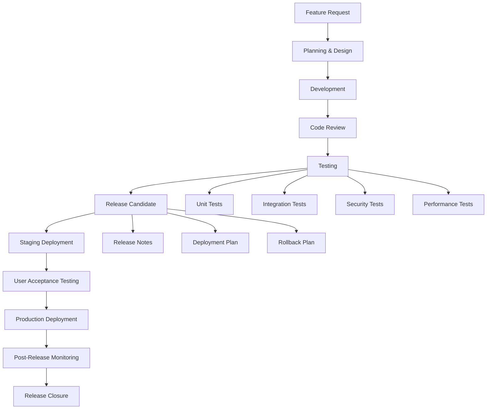

# Akashic Intelligence - Release Management & Change Control

## Overview

This document outlines the comprehensive release management process, change control procedures, and version management strategy for the Akashic Intelligence Campaign Console platform.

## Table of Contents

1. [Release Management Process](#release-management-process)
2. [Version Control Strategy](#version-control-strategy)
3. [Change Control Board](#change-control-board)
4. [Release Planning](#release-planning)
5. [Testing & Quality Gates](#testing--quality-gates)
6. [Deployment Strategy](#deployment-strategy)
7. [Rollback Procedures](#rollback-procedures)
8. [Communication & Documentation](#communication--documentation)
9. [Post-Release Activities](#post-release-activities)
10. [Release Metrics & KPIs](#release-metrics--kpis)

---

## Release Management Process

### Release Lifecycle



### Release Types

#### Major Releases (X.0.0)
- **Frequency**: Quarterly
- **Content**: New features, architectural changes, breaking changes
- **Timeline**: 12-week development cycle
- **Approval**: Change Control Board required

#### Minor Releases (X.Y.0)
- **Frequency**: Monthly
- **Content**: Feature enhancements, non-breaking changes
- **Timeline**: 4-week development cycle
- **Approval**: Release Manager approval

#### Patch Releases (X.Y.Z)
- **Frequency**: As needed
- **Content**: Bug fixes, security patches, critical updates
- **Timeline**: 1-2 week turnaround
- **Approval**: Technical Lead approval

#### Hotfixes (X.Y.Z-hotfix)
- **Frequency**: Emergency only
- **Content**: Critical production issues
- **Timeline**: Same-day deployment
- **Approval**: CTO approval required

### Release Calendar 2024

```yaml
release_schedule_2024:
  q1:
    major_release:
      version: "2.0.0"
      date: "2024-03-15"
      theme: "Advanced Analytics & Reporting"
    
    minor_releases:
      - version: "1.5.0"
        date: "2024-01-15"
        theme: "Enhanced Message Generation"
      - version: "1.6.0"
        date: "2024-02-15"
        theme: "Team Collaboration Improvements"
  
  q2:
    major_release:
      version: "2.1.0"
      date: "2024-06-15"
      theme: "Mobile Application Launch"
    
    minor_releases:
      - version: "2.0.1"
        date: "2024-04-15"
        theme: "Analytics Bug Fixes"
      - version: "2.0.2"
        date: "2024-05-15"
        theme: "Performance Optimizations"
```

---

## Version Control Strategy

### Semantic Versioning

**Version Format**: `MAJOR.MINOR.PATCH`

```
MAJOR: Breaking changes, major new features
MINOR: New features, backward compatible
PATCH: Bug fixes, security updates

Examples:
1.0.0 → Initial release
1.1.0 → New messaging features
1.1.1 → Bug fixes
2.0.0 → Major UI overhaul (breaking changes)
```

### Git Workflow

#### Branch Strategy

```
main (production)
├── develop (integration)
│   ├── feature/user-dashboard-redesign
│   ├── feature/advanced-analytics
│   └── feature/mobile-app
├── release/v2.0.0
├── hotfix/critical-security-patch
└── support/v1.x (long-term support)
```

**Branch Types**:
- **main**: Production-ready code
- **develop**: Integration branch for features
- **feature/***: Individual feature development
- **release/***: Release preparation and testing
- **hotfix/***: Emergency production fixes
- **support/***: Long-term support branches

#### Commit Standards

```
feat: add advanced message analytics dashboard
fix: resolve user authentication timeout issue
docs: update API documentation for v2.0
style: improve mobile responsive layout
refactor: optimize database query performance
test: add integration tests for message API
chore: update dependencies to latest versions

Breaking Change:
feat!: redesign user authentication system

BREAKING CHANGE: The authentication API has changed.
Users will need to re-authenticate after this update.
```

### Release Branching

#### Release Branch Creation

```bash
# Create release branch from develop
git checkout develop
git pull origin develop
git checkout -b release/v2.0.0

# Update version numbers
npm version 2.0.0 --no-git-tag-version
git add package.json package-lock.json
git commit -m "chore: bump version to 2.0.0"

# Push release branch
git push origin release/v2.0.0
```

#### Release Finalization

```bash
# Merge to main
git checkout main
git merge --no-ff release/v2.0.0
git tag -a v2.0.0 -m "Release version 2.0.0"

# Merge back to develop
git checkout develop
git merge --no-ff release/v2.0.0

# Push everything
git push origin main develop --tags

# Delete release branch
git branch -d release/v2.0.0
git push origin --delete release/v2.0.0
```

---

## Change Control Board

### Board Composition

**Voting Members**:
- **CTO** (Chair): Technical leadership and final decisions
- **Product Manager**: Product strategy and user impact
- **Engineering Lead**: Technical feasibility and resource allocation
- **QA Manager**: Quality and testing requirements
- **Security Lead**: Security implications and compliance

**Advisory Members**:
- **Customer Success Manager**: Customer impact assessment
- **DevOps Lead**: Infrastructure and deployment considerations
- **UX Design Lead**: User experience implications

### Change Request Process

#### Change Request Template

```yaml
change_request:
  id: "CR-2024-001"
  title: "Implement Advanced Message Analytics"
  requestor: "Product Team"
  date_submitted: "2024-01-15"
  
  description: |
    Add comprehensive analytics dashboard for message performance,
    including sentiment analysis, engagement metrics, and A/B testing
    capabilities.
  
  business_justification: |
    Customers have requested better insights into message performance.
    This feature is expected to increase user retention by 15% and
    enable upselling to premium analytics plans.
  
  impact_assessment:
    scope: "major"
    effort_estimate: "8 weeks"
    resource_requirements:
      - "2 frontend developers"
      - "1 backend developer" 
      - "1 data scientist"
      - "0.5 QA engineer"
    
    technical_impact:
      - "New analytics microservice"
      - "Database schema changes"
      - "New API endpoints"
      - "Frontend dashboard components"
    
    business_impact:
      - "Revenue opportunity: $50K/month"
      - "Customer satisfaction improvement"
      - "Competitive differentiation"
    
    risk_assessment:
      - risk: "Performance impact on existing queries"
        probability: "medium"
        impact: "medium"
        mitigation: "Query optimization and caching"
      
      - risk: "Delayed delivery of other features"
        probability: "high"
        impact: "low"
        mitigation: "Resource reallocation"
  
  acceptance_criteria:
    - "Analytics dashboard accessible to all paid users"
    - "Real-time updates within 5 minutes"
    - "Historical data for past 12 months"
    - "Export functionality for all charts"
    - "Mobile-responsive design"
  
  dependencies:
    - "Message tracking infrastructure"
    - "Data warehouse setup"
    - "Third-party analytics service integration"
  
  timeline:
    design_phase: "2 weeks"
    development_phase: "5 weeks"
    testing_phase: "1 week"
    deployment_phase: "1 week"
    
  success_metrics:
    - "User engagement with analytics: >60%"
    - "Page load time: <3 seconds"
    - "Zero critical bugs in first month"
```

#### Decision Matrix

**Evaluation Criteria**:
```yaml
evaluation_criteria:
  business_value:
    weight: 30%
    score_range: 1-10
    description: "Revenue impact and customer value"
  
  technical_complexity:
    weight: 20%
    score_range: 1-10
    description: "Implementation difficulty and risk"
  
  resource_availability:
    weight: 15%
    score_range: 1-10
    description: "Team capacity and timeline"
  
  strategic_alignment:
    weight: 20%
    score_range: 1-10
    description: "Alignment with product roadmap"
  
  customer_impact:
    weight: 15%
    score_range: 1-10
    description: "User experience and satisfaction"
```

---

## Release Planning

### Release Planning Process

#### Feature Prioritization

**MoSCoW Method**:
- **Must Have**: Critical features required for release
- **Should Have**: Important features that add significant value
- **Could Have**: Nice-to-have features if time permits
- **Won't Have**: Features deferred to future releases

#### Capacity Planning

```yaml
team_capacity_q1_2024:
  development_team:
    frontend_developers: 4
    backend_developers: 3
    full_stack_developers: 2
    mobile_developers: 1
    
  qa_team:
    qa_engineers: 2
    automation_engineers: 1
    
  design_team:
    ux_designers: 2
    ui_designers: 1
    
  capacity_per_sprint:
    story_points: 60
    days_available: 10
    velocity: 6_points_per_day
```

### Sprint Planning

#### Sprint Structure

**2-Week Sprints**:
- **Sprint Planning**: Monday (4 hours)
- **Daily Standups**: Every day (15 minutes)
- **Sprint Review**: Friday Week 2 (2 hours)
- **Sprint Retrospective**: Friday Week 2 (1 hour)

#### Story Point Estimation

**Fibonacci Scale**:
- **1**: Simple bug fixes, minor UI changes
- **2**: Small features, configuration changes
- **3**: Medium features, API endpoints
- **5**: Complex features, integrations
- **8**: Large features, architectural changes
- **13**: Epic-level work, major components

### Risk Management

#### Risk Categories

**Technical Risks**:
- Third-party service dependencies
- Performance and scalability concerns
- Security vulnerabilities
- Technical debt accumulation

**Business Risks**:
- Market competition
- Customer adoption
- Resource constraints
- Regulatory changes

#### Risk Mitigation Strategies

```yaml
risk_mitigation:
  technical_debt:
    strategy: "Allocate 20% of sprint capacity to technical debt"
    monitoring: "Code quality metrics and automated analysis"
    trigger: "Technical debt ratio exceeds 15%"
  
  third_party_dependencies:
    strategy: "Implement fallback mechanisms and service abstractions"
    monitoring: "Service health checks and SLA monitoring"
    trigger: "Service unavailability exceeds 1 hour"
  
  performance_degradation:
    strategy: "Continuous performance monitoring and optimization"
    monitoring: "Response time and throughput metrics"
    trigger: "P95 response time exceeds 500ms"
```

---

## Testing & Quality Gates

### Quality Gate Framework

#### Gate 1: Code Quality
```yaml
code_quality_gate:
  requirements:
    - code_coverage: ">= 90%"
    - sonar_quality_gate: "passed"
    - eslint_errors: "0"
    - typescript_errors: "0"
    - security_vulnerabilities: "0 critical, <= 5 high"
  
  automated_checks:
    - unit_tests: "all passing"
    - integration_tests: "all passing"
    - linting: "no errors"
    - type_checking: "no errors"
    - security_scan: "passed"
```

#### Gate 2: Functional Testing
```yaml
functional_testing_gate:
  requirements:
    - acceptance_tests: "all passing"
    - regression_tests: "all passing"
    - api_tests: "all passing"
    - ui_tests: "all passing"
    - cross_browser_tests: "passed"
  
  manual_testing:
    - exploratory_testing: "completed"
    - usability_testing: "passed"
    - accessibility_testing: "WCAG 2.1 AA compliant"
```

#### Gate 3: Performance & Security
```yaml
performance_security_gate:
  requirements:
    - load_testing: "passed"
    - performance_benchmarks: "met"
    - security_testing: "passed"
    - penetration_testing: "passed"
    - compliance_check: "passed"
  
  benchmarks:
    - page_load_time: "<= 2 seconds"
    - api_response_time: "<= 200ms"
    - concurrent_users: ">= 1000"
    - throughput: ">= 100 rps"
```

### Automated Testing Pipeline

```yaml
testing_pipeline:
  stage_1_unit_tests:
    trigger: "on every commit"
    duration: "5 minutes"
    tools: ["jest", "vitest"]
    coverage_threshold: 90%
  
  stage_2_integration_tests:
    trigger: "on pull request"
    duration: "15 minutes" 
    tools: ["cypress", "playwright"]
    environment: "test"
  
  stage_3_e2e_tests:
    trigger: "on merge to develop"
    duration: "30 minutes"
    tools: ["playwright", "cypress"]
    environment: "staging"
  
  stage_4_performance_tests:
    trigger: "on release candidate"
    duration: "60 minutes"
    tools: ["k6", "artillery"]
    environment: "staging"
  
  stage_5_security_tests:
    trigger: "on release candidate"
    duration: "45 minutes"
    tools: ["snyk", "sonarqube", "zap"]
    environment: "staging"
```

---

## Deployment Strategy

### Deployment Environments

#### Environment Progression

```
Developer → CI/CD → Development → Testing → Staging → Production
```

**Environment Specifications**:
```yaml
environments:
  development:
    purpose: "Feature development and initial testing"
    data: "Synthetic test data"
    integrations: "Mock services"
    deployment: "Automatic on merge to develop"
  
  testing:
    purpose: "QA testing and automation"
    data: "Anonymized production subset"
    integrations: "Sandbox services"
    deployment: "Automatic on passing tests"
  
  staging:
    purpose: "Production-like testing and UAT"
    data: "Production-like dataset"
    integrations: "Production services (test mode)"
    deployment: "Manual approval required"
  
  production:
    purpose: "Live customer environment"
    data: "Live customer data"
    integrations: "Production services"
    deployment: "Manual approval + change control"
```

### Deployment Patterns

#### Blue-Green Deployment

```yaml
blue_green_deployment:
  strategy: "Zero-downtime deployment with instant rollback"
  
  process:
    1. "Deploy new version to inactive environment (Green)"
    2. "Run health checks and smoke tests"
    3. "Switch traffic from Blue to Green"
    4. "Monitor for issues"
    5. "Keep Blue environment as rollback option"
  
  benefits:
    - "Zero downtime"
    - "Instant rollback capability"
    - "Production testing before traffic switch"
  
  considerations:
    - "Requires double infrastructure"
    - "Database migration complexity"
    - "Stateful application challenges"
```

#### Rolling Deployment

```yaml
rolling_deployment:
  strategy: "Gradual replacement of instances"
  
  process:
    1. "Deploy to 25% of instances"
    2. "Monitor metrics for 10 minutes"
    3. "Deploy to 50% of instances"
    4. "Monitor metrics for 10 minutes"
    5. "Deploy to 100% of instances"
  
  benefits:
    - "Lower resource requirements"
    - "Gradual risk exposure"
    - "Early issue detection"
  
  rollback_triggers:
    - "Error rate > 1%"
    - "Response time > 2x baseline"
    - "Health check failures > 10%"
```

#### Canary Deployment

```yaml
canary_deployment:
  strategy: "Limited exposure to new version"
  
  traffic_routing:
    canary: 5%
    stable: 95%
  
  success_criteria:
    - "Error rate < 0.1%"
    - "Response time within 10% of baseline"
    - "User satisfaction metrics stable"
  
  monitoring_period: "24 hours"
  
  progression:
    - "5% for 24 hours"
    - "25% for 12 hours"
    - "50% for 6 hours"
    - "100% if all metrics pass"
```

### Database Migration Strategy

#### Migration Best Practices

```sql
-- Example migration with rollback plan
-- Migration: Add user preferences table
-- Rollback: Drop user preferences table

BEGIN;

-- Forward migration
CREATE TABLE user_preferences (
    id UUID PRIMARY KEY DEFAULT gen_random_uuid(),
    user_id UUID NOT NULL REFERENCES users(id),
    preferences JSONB NOT NULL DEFAULT '{}',
    created_at TIMESTAMP WITH TIME ZONE DEFAULT NOW(),
    updated_at TIMESTAMP WITH TIME ZONE DEFAULT NOW()
);

CREATE INDEX idx_user_preferences_user_id ON user_preferences(user_id);

-- Add trigger for updated_at
CREATE TRIGGER user_preferences_updated_at
    BEFORE UPDATE ON user_preferences
    FOR EACH ROW
    EXECUTE FUNCTION update_updated_at_column();

-- Rollback plan (commented for documentation)
-- DROP TABLE IF EXISTS user_preferences;

COMMIT;
```

#### Zero-Downtime Migrations

```yaml
migration_strategy:
  phase_1_additive_changes:
    - "Add new columns with default values"
    - "Add new tables"
    - "Add new indexes concurrently"
    
  phase_2_data_migration:
    - "Migrate data in batches"
    - "Update application to use new schema"
    - "Maintain backward compatibility"
    
  phase_3_cleanup:
    - "Remove old columns after full deployment"
    - "Drop unused indexes"
    - "Clean up deprecated code"
```

---

## Rollback Procedures

### Rollback Decision Matrix

#### Rollback Triggers

**Automatic Rollback**:
- Error rate > 5%
- Response time > 5x baseline
- Health check failures > 50%
- Database connection failures
- Critical security vulnerabilities

**Manual Rollback Consideration**:
- Error rate 1-5%
- Response time 2-5x baseline
- User complaints > 10% increase
- Performance degradation
- Feature functionality issues

### Rollback Procedures

#### Application Rollback

```bash
#!/bin/bash
# Application rollback script

ENVIRONMENT=${1:-staging}
PREVIOUS_VERSION=${2}

echo "🔄 Starting rollback for ${ENVIRONMENT}"

if [[ -z "${PREVIOUS_VERSION}" ]]; then
    # Get previous version from deployment history
    PREVIOUS_VERSION=$(kubectl rollout history deployment/akashic-intelligence \
        -n akashic-${ENVIRONMENT} | tail -2 | head -1 | awk '{print $1}')
fi

echo "📦 Rolling back to version: ${PREVIOUS_VERSION}"

# Perform rollback
kubectl rollout undo deployment/akashic-intelligence \
    --to-revision=${PREVIOUS_VERSION} \
    -n akashic-${ENVIRONMENT}

# Wait for rollback to complete
kubectl rollout status deployment/akashic-intelligence \
    -n akashic-${ENVIRONMENT} \
    --timeout=300s

# Verify rollback success
echo "🔍 Verifying rollback..."
curl -f https://${ENVIRONMENT}.akashicintelligence.com/api/health

echo "✅ Rollback completed successfully"
```

#### Database Rollback

```yaml
database_rollback:
  scenario_1_schema_changes:
    method: "Restore from backup"
    steps:
      - "Stop application traffic"
      - "Restore database from pre-migration backup"
      - "Deploy previous application version"
      - "Verify data integrity"
    
  scenario_2_data_changes:
    method: "Reverse data migration"
    steps:
      - "Run reverse migration scripts"
      - "Verify data consistency"
      - "Update application if needed"
    
  scenario_3_critical_corruption:
    method: "Point-in-time recovery"
    steps:
      - "Identify last known good state"
      - "Restore from continuous backup"
      - "Replay transaction logs"
      - "Validate data integrity"
```

### Rollback Communication

#### Stakeholder Notification

```yaml
rollback_communication:
  immediate_notification:
    recipients: ["engineering_team", "product_team", "customer_success"]
    method: "Slack alert + email"
    template: |
      🚨 ROLLBACK IN PROGRESS
      
      Environment: {{ environment }}
      Reason: {{ rollback_reason }}
      ETA: {{ estimated_completion }}
      
      Status updates will be provided every 15 minutes.
  
  customer_notification:
    triggers:
      - "Production rollback"
      - "Extended downtime (>30 minutes)"
    method: "Status page + email"
    template: |
      We are experiencing technical issues and are working to resolve them.
      Some features may be temporarily unavailable.
      
      Expected resolution: {{ eta }}
      Status updates: {{ status_page_url }}
```

---

## Communication & Documentation

### Release Notes

#### Release Notes Template

```markdown
# Akashic Intelligence v2.0.0 Release Notes
*Released: March 15, 2024*

## 🎉 What's New

### Advanced Analytics Dashboard
- **Message Performance Metrics**: Track engagement, reach, and effectiveness
- **Sentiment Analysis**: AI-powered sentiment scoring for all messages
- **A/B Testing**: Compare message variants and optimize performance
- **Custom Reports**: Build and schedule custom analytics reports

### Enhanced Team Collaboration
- **Real-time Editing**: Collaborate on messages with live editing
- **Comment System**: Add feedback and suggestions directly on messages
- **Approval Workflows**: Customizable message approval processes
- **Activity Feed**: Stay updated on team actions and changes

## 🔧 Improvements

### Performance Enhancements
- **50% faster message generation** through optimized AI integration
- **Improved loading times** for analytics dashboards
- **Better mobile performance** with optimized asset delivery

### User Experience
- **Redesigned navigation** for easier feature discovery
- **Improved search functionality** across all content
- **Enhanced accessibility** with WCAG 2.1 AA compliance

## 🐛 Bug Fixes

- Fixed issue with message approval notifications not being sent
- Resolved problem with CSV import hanging on large files
- Corrected timezone display issues in activity logs
- Fixed mobile layout issues on small screens

## 🔒 Security Updates

- Implemented additional API rate limiting
- Enhanced password strength requirements
- Updated third-party dependencies with security patches
- Improved audit logging for compliance

## 📊 Database Changes

⚠️ **Important**: This release includes database migrations that will run automatically during deployment. Expected downtime: 5-10 minutes.

## 🚀 Migration Guide

### For Administrators
1. **Backup your data** before upgrading (automatic backup will be created)
2. **Review new permissions** for team roles and update as needed
3. **Configure analytics settings** in the admin dashboard

### For Users
1. **Clear browser cache** after the update for optimal performance
2. **Review new analytics features** in the updated dashboard
3. **Update bookmarks** if you have saved links to specific pages

## 🔗 API Changes

### New Endpoints
- `GET /api/v1/analytics/messages` - Message performance analytics
- `POST /api/v1/messages/compare` - A/B test message variants
- `GET /api/v1/team/activity` - Team activity feed

### Changed Endpoints
- `GET /api/v1/messages` now includes `sentiment_score` field
- `POST /api/v1/messages` accepts new `target_metrics` parameter

### Deprecated Endpoints
- `GET /api/v1/stats/basic` - Use `/api/v1/analytics/summary` instead

## 📞 Support

If you experience any issues with this release:
- Check our [troubleshooting guide](https://docs.akashicintelligence.com/troubleshooting)
- Contact support at support@akashicintelligence.com
- Join our community Slack for peer support

## 🔮 Coming Next

Preview of features in development for v2.1.0:
- Mobile application for iOS and Android
- Advanced voter segmentation tools
- Integration with additional social media platforms
- Multi-language message generation

---

**Full Changelog**: [v1.6.2...v2.0.0](https://github.com/akashic-intelligence/platform/compare/v1.6.2...v2.0.0)
```

### Documentation Updates

#### Documentation Checklist

```yaml
documentation_updates:
  user_documentation:
    - "Update user guide with new features"
    - "Create video tutorials for major changes"
    - "Update FAQ with common questions"
    - "Refresh screenshots and walkthroughs"
  
  technical_documentation:
    - "Update API documentation"
    - "Document database schema changes"
    - "Update deployment procedures"
    - "Refresh troubleshooting guides"
  
  training_materials:
    - "Update onboarding materials"
    - "Create training videos for new features"
    - "Update customer success playbooks"
    - "Refresh support documentation"
```

---

## Post-Release Activities

### Release Monitoring

#### Key Metrics to Monitor

```yaml
post_release_monitoring:
  application_metrics:
    - "Error rates by endpoint"
    - "Response times (P50, P95, P99)"
    - "Database query performance"
    - "Cache hit rates"
    - "API usage patterns"
  
  business_metrics:
    - "User adoption of new features"
    - "Feature usage patterns"
    - "Customer satisfaction scores"
    - "Support ticket volume and types"
    - "Revenue impact"
  
  user_experience_metrics:
    - "Page load times"
    - "User journey completion rates"
    - "Error rates in user flows"
    - "Mobile vs desktop usage"
    - "Geographic performance variations"
```

#### Monitoring Dashboard

```
Post-Release Monitoring Dashboard:
┌─────────────────────────────────────────────────────┐
│ RELEASE v2.0.0 - 24 HOUR STATUS                    │
├─────────────────────────────────────────────────────┤
│ 📊 Error Rate: 0.08% (↓ 0.02%)                     │
│ ⚡ Response Time: 180ms (↓ 20ms)                   │
│ 👥 Active Users: 2,547 (↑ 150)                     │
│ 🎯 Feature Adoption: 23% (new analytics)           │
└─────────────────────────────────────────────────────┘

Alerts (Past 24h):
• 🟡 High CPU usage on server-3 (resolved)
• 🟢 Database migration completed successfully
• 🟢 All health checks passing

Support Tickets:
• 📩 12 new tickets (8 feature questions, 4 minor bugs)
• ⏱️ Average response time: 2.1 hours
• 📈 95% customer satisfaction
```

### Post-Release Review

#### Release Retrospective

**Retrospective Template**:
```yaml
release_retrospective:
  release_info:
    version: "v2.0.0"
    release_date: "2024-03-15"
    team_members: ["John Doe", "Jane Smith", "Mike Johnson"]
  
  what_went_well:
    - "Smooth deployment with zero downtime"
    - "All critical features delivered on time"
    - "Great collaboration between teams"
    - "Comprehensive testing caught major issues"
  
  what_could_improve:
    - "Communication about API changes could be earlier"
    - "Documentation updates took longer than expected"
    - "More performance testing needed for analytics features"
  
  action_items:
    - owner: "Product Team"
      task: "Improve API change communication process"
      due_date: "2024-04-01"
    
    - owner: "Engineering Team"
      task: "Add performance testing to analytics features"
      due_date: "2024-04-15"
    
    - owner: "Documentation Team"
      task: "Start documentation updates earlier in cycle"
      due_date: "2024-04-01"
  
  metrics:
    planned_vs_actual_scope: "100% of planned features delivered"
    timeline_adherence: "Released 2 days early"
    bug_rate: "3 bugs found in first week (target: <5)"
    customer_satisfaction: "4.7/5 (target: >4.5)"
```

### Continuous Improvement

#### Process Optimization

**Release Process Improvements**:
```yaml
process_improvements:
  cycle_1_q1_2024:
    improvements:
      - "Automated more deployment steps"
      - "Improved test coverage requirements"
      - "Enhanced rollback procedures"
    
    results:
      - "30% reduction in deployment time"
      - "50% fewer post-release bugs"
      - "Faster rollback capability"
  
  cycle_2_q2_2024:
    planned_improvements:
      - "Implement feature flag system"
      - "Automate documentation generation"
      - "Enhance monitoring and alerting"
    
    expected_outcomes:
      - "Safer feature rollouts"
      - "Reduced documentation effort"
      - "Faster issue detection"
```

---

## Release Metrics & KPIs

### Key Performance Indicators

#### Release Quality Metrics

```yaml
quality_metrics:
  defect_density:
    calculation: "Bugs found / Features delivered"
    target: "< 0.1 bugs per feature"
    q1_2024_actual: "0.08 bugs per feature"
  
  customer_satisfaction:
    calculation: "Post-release survey rating (1-5)"
    target: "> 4.5"
    q1_2024_actual: "4.7"
  
  time_to_resolution:
    calculation: "Average time to fix post-release bugs"
    target: "< 24 hours for critical, < 72 hours for major"
    q1_2024_actual: "18 hours critical, 48 hours major"
```

#### Release Efficiency Metrics

```yaml
efficiency_metrics:
  cycle_time:
    calculation: "Time from feature request to production"
    target: "< 8 weeks for major features"
    q1_2024_actual: "6.5 weeks average"
  
  deployment_frequency:
    calculation: "Releases per month"
    target: "4-6 releases per month"
    q1_2024_actual: "5.2 releases per month"
  
  lead_time:
    calculation: "Time from code commit to production"
    target: "< 4 hours"
    q1_2024_actual: "2.8 hours average"
  
  rollback_rate:
    calculation: "Rollbacks / Total deployments"
    target: "< 2%"
    q1_2024_actual: "1.3%"
```

### Release Success Criteria

#### Definition of Success

**Technical Success**:
- Zero critical post-release bugs
- All performance benchmarks met
- No rollbacks required
- All planned features delivered

**Business Success**:
- User adoption targets met
- Customer satisfaction maintained
- Revenue impact positive
- Support ticket volume stable

**Process Success**:
- Timeline adherence achieved
- Resource utilization optimized
- Team satisfaction high
- Lessons learned documented

---

This comprehensive Release Management & Change Control documentation ensures systematic, high-quality software delivery while maintaining platform stability and customer satisfaction.

