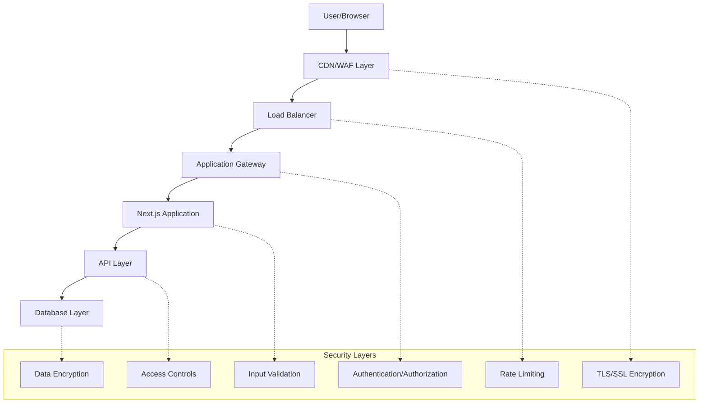

# Akashic Intelligence - Security & Compliance Documentation

## Overview

This document outlines the comprehensive security framework, compliance requirements, and data protection measures for the Akashic Intelligence Campaign Console platform.

## Table of Contents

1. [Security Architecture](#security-architecture)
2. [Authentication & Authorization](#authentication--authorization)
3. [Data Protection & Privacy](#data-protection--privacy)
4. [Network Security](#network-security)
5. [Application Security](#application-security)
6. [Infrastructure Security](#infrastructure-security)
7. [Compliance Framework](#compliance-framework)
8. [Incident Response Plan](#incident-response-plan)
9. [Security Monitoring](#security-monitoring)
10. [Security Training & Awareness](#security-training--awareness)

---

## Security Architecture

### Defense in Depth Strategy



### Security Principles

1. **Zero Trust Architecture**: Never trust, always verify
2. **Principle of Least Privilege**: Minimum necessary access
3. **Defense in Depth**: Multiple security layers
4. **Security by Design**: Built-in security from development
5. **Data Minimization**: Collect only necessary data
6. **Encryption Everywhere**: Data encrypted at rest and in transit

### Threat Model

#### Assets
- **Critical**: User credentials, voter data, financial information
- **High**: Campaign strategies, internal communications, AI models
- **Medium**: Message content, analytics data, team information
- **Low**: Public campaign information, general settings

#### Threat Actors
- **External Attackers**: Malicious hackers, foreign adversaries
- **Insider Threats**: Malicious employees, compromised accounts
- **Competitors**: Opposition campaigns, corporate espionage
- **State Actors**: Foreign government interference

#### Attack Vectors
- **Web Application**: XSS, SQL injection, CSRF attacks
- **Authentication**: Credential stuffing, phishing, MFA bypass
- **Infrastructure**: DDoS, server vulnerabilities, misconfigurations
- **Social Engineering**: Phishing, pretexting, business email compromise

---

## Authentication & Authorization

### Multi-Factor Authentication (MFA)

```typescript
// lib/auth/mfa.ts
interface MFAConfig {
  required: boolean
  methods: MFAMethod[]
  backupCodes: boolean
  gracePeriod: number // days
}

enum MFAMethod {
  TOTP = 'totp',           // Time-based One-Time Password
  SMS = 'sms',             // SMS verification
  EMAIL = 'email',         // Email verification
  WEBAUTHN = 'webauthn',   // Hardware security keys
  BACKUP_CODES = 'backup'  // Single-use backup codes
}

class MFAService {
  async enableMFA(userId: string, method: MFAMethod): Promise<MFASetup> {
    switch (method) {
      case MFAMethod.TOTP:
        return this.setupTOTP(userId)
      case MFAMethod.WEBAUTHN:
        return this.setupWebAuthn(userId)
      case MFAMethod.SMS:
        return this.setupSMS(userId)
      default:
        throw new Error('Unsupported MFA method')
    }
  }

  async verifyMFA(
    userId: string, 
    method: MFAMethod, 
    code: string
  ): Promise<boolean> {
    const user = await prisma.user.findUnique({
      where: { id: userId },
      include: { mfaTokens: true }
    })

    if (!user) return false

    switch (method) {
      case MFAMethod.TOTP:
        return this.verifyTOTP(user.mfaTokens, code)
      case MFAMethod.WEBAUTHN:
        return this.verifyWebAuthn(userId, code)
      default:
        return false
    }
  }

  private async setupTOTP(userId: string): Promise<MFASetup> {
    const secret = generateTOTPSecret()
    const qrCode = await generateQRCode(secret, userId)
    
    await prisma.mfaToken.create({
      data: {
        userId,
        type: MFAMethod.TOTP,
        secret: await encrypt(secret),
        isActive: false // Activated after verification
      }
    })

    return {
      secret,
      qrCode,
      backupCodes: this.generateBackupCodes()
    }
  }
}
```

### Role-Based Access Control (RBAC)

```typescript
// lib/auth/rbac.ts
export interface Role {
  id: string
  name: string
  permissions: Permission[]
  inherits?: string[] // Role inheritance
}

export const SYSTEM_ROLES: Record<string, Role> = {
  super_admin: {
    id: 'super_admin',
    name: 'Super Administrator',
    permissions: [Permission.ALL],
    inherits: []
  },
  
  campaign_owner: {
    id: 'campaign_owner',
    name: 'Campaign Owner',
    permissions: [
      Permission.CAMPAIGN_FULL_ACCESS,
      Permission.TEAM_MANAGE,
      Permission.BILLING_MANAGE,
      Permission.DATA_FULL_ACCESS,
      Permission.SETTINGS_MANAGE
    ],
    inherits: []
  },
  
  campaign_manager: {
    id: 'campaign_manager',
    name: 'Campaign Manager',
    permissions: [
      Permission.CAMPAIGN_EDIT,
      Permission.TEAM_VIEW,
      Permission.MESSAGE_APPROVE,
      Permission.DATA_IMPORT_EXPORT,
      Permission.ANALYTICS_VIEW
    ],
    inherits: ['content_creator']
  },
  
  content_creator: {
    id: 'content_creator',
    name: 'Content Creator',
    permissions: [
      Permission.CAMPAIGN_VIEW,
      Permission.MESSAGE_CREATE,
      Permission.MESSAGE_EDIT_OWN,
      Permission.DATA_VIEW,
      Permission.ANALYTICS_VIEW
    ],
    inherits: []
  },
  
  analyst: {
    id: 'analyst',
    name: 'Data Analyst',
    permissions: [
      Permission.CAMPAIGN_VIEW,
      Permission.DATA_VIEW,
      Permission.DATA_EXPORT,
      Permission.ANALYTICS_FULL_ACCESS
    ],
    inherits: []
  }
}

export class RBACService {
  async checkPermission(
    userId: string,
    campaignId: string,
    permission: Permission
  ): Promise<boolean> {
    // Get user's role in campaign
    const teamMember = await prisma.teamMember.findFirst({
      where: { userId, campaignId },
      include: { customPermissions: true }
    })

    if (!teamMember) return false

    // Check role permissions
    const role = SYSTEM_ROLES[teamMember.role]
    if (!role) return false

    // Check direct permission
    if (role.permissions.includes(permission)) return true

    // Check inherited permissions
    if (role.inherits) {
      for (const inheritedRoleId of role.inherits) {
        const inheritedRole = SYSTEM_ROLES[inheritedRoleId]
        if (inheritedRole?.permissions.includes(permission)) return true
      }
    }

    // Check custom permissions
    return teamMember.customPermissions.some(p => p.permission === permission)
  }

  async assignRole(
    userId: string,
    campaignId: string,
    role: string,
    assignedBy: string
  ): Promise<void> {
    // Verify assigner has permission
    const canAssign = await this.checkPermission(
      assignedBy,
      campaignId,
      Permission.TEAM_EDIT_ROLES
    )

    if (!canAssign) {
      throw new Error('Insufficient permissions to assign roles')
    }

    // Update team member role
    await prisma.teamMember.update({
      where: {
        userId_campaignId: { userId, campaignId }
      },
      data: {
        role,
        updatedAt: new Date()
      }
    })

    // Log role change
    await this.logSecurityEvent({
      type: 'role_assigned',
      userId,
      campaignId,
      details: { newRole: role, assignedBy }
    })
  }
}
```

### Session Management

```typescript
// lib/auth/session.ts
interface SessionConfig {
  maxAge: number           // Session lifetime (seconds)
  renewThreshold: number   // Time before expiry to renew
  maxSessions: number      // Maximum concurrent sessions
  secureCookies: boolean   // HTTPS only cookies
  sameSite: 'strict' | 'lax' | 'none'
}

export const SESSION_CONFIG: SessionConfig = {
  maxAge: 8 * 60 * 60,    // 8 hours
  renewThreshold: 30 * 60, // 30 minutes
  maxSessions: 3,          // 3 concurrent sessions
  secureCookies: true,
  sameSite: 'strict'
}

class SessionManager {
  async createSession(userId: string, deviceInfo: DeviceInfo): Promise<Session> {
    // Check session limits
    await this.enforceSessionLimits(userId)

    // Generate secure session token
    const sessionToken = await generateSecureToken()
    const sessionId = generateSessionId()

    // Create session record
    const session = await prisma.session.create({
      data: {
        id: sessionId,
        userId,
        sessionToken: await hashToken(sessionToken),
        deviceFingerprint: deviceInfo.fingerprint,
        ipAddress: deviceInfo.ipAddress,
        userAgent: deviceInfo.userAgent,
        expiresAt: new Date(Date.now() + SESSION_CONFIG.maxAge * 1000)
      }
    })

    // Log session creation
    await this.logSecurityEvent({
      type: 'session_created',
      userId,
      sessionId,
      ipAddress: deviceInfo.ipAddress
    })

    return session
  }

  async validateSession(sessionToken: string): Promise<Session | null> {
    const hashedToken = await hashToken(sessionToken)
    
    const session = await prisma.session.findFirst({
      where: {
        sessionToken: hashedToken,
        expiresAt: { gt: new Date() }
      },
      include: { user: true }
    })

    if (!session) return null

    // Check for session renewal
    const timeUntilExpiry = session.expiresAt.getTime() - Date.now()
    if (timeUntilExpiry < SESSION_CONFIG.renewThreshold * 1000) {
      await this.renewSession(session.id)
    }

    // Update last activity
    await prisma.session.update({
      where: { id: session.id },
      data: { lastActivity: new Date() }
    })

    return session
  }

  async revokeSession(sessionId: string, reason: string): Promise<void> {
    const session = await prisma.session.delete({
      where: { id: sessionId }
    })

    await this.logSecurityEvent({
      type: 'session_revoked',
      userId: session.userId,
      sessionId,
      details: { reason }
    })
  }

  private async enforceSessionLimits(userId: string): Promise<void> {
    const activeSessions = await prisma.session.count({
      where: {
        userId,
        expiresAt: { gt: new Date() }
      }
    })

    if (activeSessions >= SESSION_CONFIG.maxSessions) {
      // Revoke oldest session
      const oldestSession = await prisma.session.findFirst({
        where: {
          userId,
          expiresAt: { gt: new Date() }
        },
        orderBy: { lastActivity: 'asc' }
      })

      if (oldestSession) {
        await this.revokeSession(oldestSession.id, 'session_limit_exceeded')
      }
    }
  }
}
```

---

## Data Protection & Privacy

### Data Classification Framework

```typescript
// lib/security/data-classification.ts
export enum DataClassification {
  PUBLIC = 'public',           // Public information
  INTERNAL = 'internal',       // Internal use only
  CONFIDENTIAL = 'confidential', // Sensitive business data
  RESTRICTED = 'restricted'     // Highly sensitive/regulated data
}

export const DATA_HANDLING_RULES: Record<DataClassification, DataHandling> = {
  [DataClassification.PUBLIC]: {
    encryption: false,
    accessControls: 'basic',
    retention: '7 years',
    sharing: 'unrestricted'
  },
  
  [DataClassification.INTERNAL]: {
    encryption: true,
    accessControls: 'authenticated',
    retention: '7 years',
    sharing: 'internal_only'
  },
  
  [DataClassification.CONFIDENTIAL]: {
    encryption: true,
    accessControls: 'role_based',
    retention: '5 years',
    sharing: 'need_to_know'
  },
  
  [DataClassification.RESTRICTED]: {
    encryption: true,
    accessControls: 'explicit_permission',
    retention: '3 years',
    sharing: 'prohibited'
  }
}

export const FIELD_CLASSIFICATIONS: Record<string, DataClassification> = {
  // User data
  'user.email': DataClassification.CONFIDENTIAL,
  'user.name': DataClassification.INTERNAL,
  'user.password': DataClassification.RESTRICTED,
  'user.mfaSecret': DataClassification.RESTRICTED,
  
  // Voter data
  'voter.email': DataClassification.CONFIDENTIAL,
  'voter.phone': DataClassification.CONFIDENTIAL,
  'voter.address': DataClassification.CONFIDENTIAL,
  'voter.votingHistory': DataClassification.RESTRICTED,
  
  // Financial data
  'payment.cardNumber': DataClassification.RESTRICTED,
  'payment.accountNumber': DataClassification.RESTRICTED,
  'donation.amount': DataClassification.CONFIDENTIAL,
  
  // Campaign data
  'campaign.name': DataClassification.PUBLIC,
  'campaign.strategy': DataClassification.CONFIDENTIAL,
  'message.content': DataClassification.INTERNAL
}
```

### Encryption Implementation

```typescript
// lib/security/encryption.ts
import { createCipher, createDecipher, randomBytes, pbkdf2Sync } from 'crypto'

export class EncryptionService {
  private readonly algorithm = 'aes-256-gcm'
  private readonly keyLength = 32
  private readonly ivLength = 16
  private readonly tagLength = 16

  async encryptField(value: string, classification: DataClassification): Promise<string> {
    if (!this.requiresEncryption(classification)) {
      return value
    }

    const key = this.getDEK(classification)
    const iv = randomBytes(this.ivLength)
    
    const cipher = createCipher(this.algorithm, key)
    cipher.setIV(iv)
    
    let encrypted = cipher.update(value, 'utf8', 'hex')
    encrypted += cipher.final('hex')
    
    const tag = cipher.getAuthTag()
    
    // Format: iv:tag:encrypted
    return `${iv.toString('hex')}:${tag.toString('hex')}:${encrypted}`
  }

  async decryptField(encryptedValue: string, classification: DataClassification): Promise<string> {
    if (!this.requiresEncryption(classification)) {
      return encryptedValue
    }

    const parts = encryptedValue.split(':')
    if (parts.length !== 3) {
      throw new Error('Invalid encrypted value format')
    }

    const [ivHex, tagHex, encrypted] = parts
    const iv = Buffer.from(ivHex, 'hex')
    const tag = Buffer.from(tagHex, 'hex')
    const key = this.getDEK(classification)

    const decipher = createDecipher(this.algorithm, key)
    decipher.setIV(iv)
    decipher.setAuthTag(tag)

    let decrypted = decipher.update(encrypted, 'hex', 'utf8')
    decrypted += decipher.final('utf8')

    return decrypted
  }

  private requiresEncryption(classification: DataClassification): boolean {
    return DATA_HANDLING_RULES[classification].encryption
  }

  private getDEK(classification: DataClassification): Buffer {
    // Get Data Encryption Key based on classification
    const kekName = `DEK_${classification.toUpperCase()}`
    const kek = process.env[kekName]
    
    if (!kek) {
      throw new Error(`Missing encryption key for classification: ${classification}`)
    }

    return pbkdf2Sync(kek, 'akashic-salt', 100000, this.keyLength, 'sha256')
  }
}
```

### Data Loss Prevention (DLP)

```typescript
// lib/security/dlp.ts
interface DLPRule {
  id: string
  name: string
  pattern: RegExp
  classification: DataClassification
  action: 'block' | 'warn' | 'log'
  exceptions?: string[]
}

export const DLP_RULES: DLPRule[] = [
  {
    id: 'ssn',
    name: 'Social Security Number',
    pattern: /\b\d{3}-?\d{2}-?\d{4}\b/g,
    classification: DataClassification.RESTRICTED,
    action: 'block'
  },
  {
    id: 'credit_card',
    name: 'Credit Card Number',
    pattern: /\b(?:\d{4}[-\s]?){3}\d{4}\b/g,
    classification: DataClassification.RESTRICTED,
    action: 'block'
  },
  {
    id: 'email',
    name: 'Email Address',
    pattern: /\b[A-Za-z0-9._%+-]+@[A-Za-z0-9.-]+\.[A-Z|a-z]{2,}\b/g,
    classification: DataClassification.CONFIDENTIAL,
    action: 'log'
  },
  {
    id: 'phone',
    name: 'Phone Number',
    pattern: /\b(?:\+?1[-.\s]?)?\(?([0-9]{3})\)?[-.\s]?([0-9]{3})[-.\s]?([0-9]{4})\b/g,
    classification: DataClassification.CONFIDENTIAL,
    action: 'log'
  }
]

export class DLPService {
  async scanContent(content: string, context: string): Promise<DLPResult> {
    const violations: DLPViolation[] = []
    let sanitizedContent = content

    for (const rule of DLP_RULES) {
      const matches = content.match(rule.pattern)
      
      if (matches) {
        const violation: DLPViolation = {
          ruleId: rule.id,
          ruleName: rule.name,
          matches: matches.length,
          classification: rule.classification,
          action: rule.action,
          context
        }

        violations.push(violation)

        // Apply action
        switch (rule.action) {
          case 'block':
            throw new DLPViolationError(`Blocked content containing ${rule.name}`)
          
          case 'warn':
            await this.logViolation(violation, 'warning')
            break
          
          case 'log':
            await this.logViolation(violation, 'info')
            sanitizedContent = sanitizedContent.replace(rule.pattern, '[REDACTED]')
            break
        }
      }
    }

    return {
      violations,
      sanitizedContent,
      passed: !violations.some(v => v.action === 'block')
    }
  }

  private async logViolation(violation: DLPViolation, level: string): Promise<void> {
    await prisma.securityEvent.create({
      data: {
        type: 'dlp_violation',
        level,
        details: violation,
        timestamp: new Date()
      }
    })
  }
}
```

### Privacy Controls

```typescript
// lib/security/privacy.ts
export class PrivacyService {
  async handleDataSubjectRequest(
    type: 'access' | 'deletion' | 'portability' | 'correction',
    userId: string,
    requestedBy: string
  ): Promise<DataSubjectResponse> {
    // Verify request authorization
    await this.verifyRequestAuthorization(userId, requestedBy)

    switch (type) {
      case 'access':
        return this.generateDataExport(userId)
      
      case 'deletion':
        return this.deleteUserData(userId)
      
      case 'portability':
        return this.exportPortableData(userId)
      
      case 'correction':
        return this.enableDataCorrection(userId)
    }
  }

  private async generateDataExport(userId: string): Promise<DataExport> {
    const userData = await prisma.user.findUnique({
      where: { id: userId },
      include: {
        campaigns: true,
        messages: true,
        teamMemberships: true,
        securityEvents: true
      }
    })

    if (!userData) {
      throw new Error('User not found')
    }

    // Remove sensitive fields
    const sanitizedData = this.sanitizeForExport(userData)

    return {
      format: 'json',
      data: sanitizedData,
      generatedAt: new Date(),
      expiresAt: new Date(Date.now() + 30 * 24 * 60 * 60 * 1000) // 30 days
    }
  }

  private async deleteUserData(userId: string): Promise<DeletionResult> {
    // Check for data retention requirements
    const retentionChecks = await this.checkRetentionRequirements(userId)
    
    if (retentionChecks.hasActiveRetention) {
      return {
        success: false,
        reason: 'active_retention_requirements',
        details: retentionChecks.requirements
      }
    }

    // Begin deletion process
    await prisma.$transaction(async (tx) => {
      // Delete in dependency order
      await tx.message.deleteMany({ where: { createdById: userId } })
      await tx.teamMember.deleteMany({ where: { userId } })
      await tx.session.deleteMany({ where: { userId } })
      await tx.securityEvent.deleteMany({ where: { userId } })
      await tx.user.delete({ where: { id: userId } })
    })

    // Log deletion
    await this.logSecurityEvent({
      type: 'user_data_deleted',
      userId,
      timestamp: new Date()
    })

    return {
      success: true,
      deletedAt: new Date()
    }
  }
}
```

---

## Network Security

### Web Application Firewall (WAF)

```yaml
# WAF Configuration
waf_rules:
  - name: "Block SQL Injection"
    pattern: "(?i)(union|select|insert|update|delete|drop|create|alter).*?(from|into|table)"
    action: "block"
    
  - name: "Block XSS Attempts"
    pattern: "(?i)(<script|javascript:|onerror=|onload=|alert\\()"
    action: "block"
    
  - name: "Rate Limit API Calls"
    path: "/api/*"
    rate_limit: "100/minute"
    action: "throttle"
    
  - name: "Block Known Attack IPs"
    source: "threat_intelligence"
    action: "block"
    
  - name: "Require Authentication"
    path: "/dashboard/*"
    requires: "valid_session"
    action: "redirect_login"
```

### TLS/SSL Configuration

```nginx
# Nginx SSL Configuration
server {
    listen 443 ssl http2;
    server_name app.akashicintelligence.com;

    # SSL Certificates
    ssl_certificate /path/to/fullchain.pem;
    ssl_certificate_key /path/to/privkey.pem;

    # SSL Security
    ssl_protocols TLSv1.2 TLSv1.3;
    ssl_ciphers ECDHE-RSA-AES256-GCM-SHA512:DHE-RSA-AES256-GCM-SHA512;
    ssl_prefer_server_ciphers off;
    ssl_dhparam /path/to/dhparam.pem;

    # Security Headers
    add_header Strict-Transport-Security "max-age=63072000" always;
    add_header X-Frame-Options DENY always;
    add_header X-Content-Type-Options nosniff always;
    add_header X-XSS-Protection "1; mode=block" always;
    add_header Referrer-Policy "strict-origin-when-cross-origin" always;
    add_header Content-Security-Policy "default-src 'self'; script-src 'self' 'unsafe-inline'; style-src 'self' 'unsafe-inline';" always;

    # OCSP Stapling
    ssl_stapling on;
    ssl_stapling_verify on;
    ssl_trusted_certificate /path/to/chain.pem;

    location / {
        proxy_pass http://app:3000;
        proxy_set_header Host $host;
        proxy_set_header X-Real-IP $remote_addr;
        proxy_set_header X-Forwarded-For $proxy_add_x_forwarded_for;
        proxy_set_header X-Forwarded-Proto $scheme;
    }
}
```

### DDoS Protection

```typescript
// lib/security/ddos-protection.ts
interface RateLimit {
  requests: number
  window: number // seconds
  burst?: number
}

export const RATE_LIMITS: Record<string, RateLimit> = {
  login: { requests: 5, window: 300, burst: 2 },     // 5 attempts per 5 minutes
  api_general: { requests: 100, window: 60 },         // 100 requests per minute
  api_generation: { requests: 10, window: 60 },       // 10 AI generations per minute
  password_reset: { requests: 3, window: 3600 },      // 3 resets per hour
  registration: { requests: 5, window: 3600 }         // 5 registrations per hour
}

export class RateLimitService {
  private redis: Redis

  constructor() {
    this.redis = new Redis(process.env.REDIS_URL!)
  }

  async checkRateLimit(
    key: string,
    identifier: string,
    rateLimit?: RateLimit
  ): Promise<RateLimitResult> {
    const limit = rateLimit || RATE_LIMITS[key]
    if (!limit) return { allowed: true, remaining: Infinity }

    const redisKey = `ratelimit:${key}:${identifier}`
    const now = Math.floor(Date.now() / 1000)
    const window = Math.floor(now / limit.window) * limit.window

    // Use sliding window log approach
    const pipeline = this.redis.pipeline()
    
    // Remove old entries
    pipeline.zremrangebyscore(redisKey, '-inf', now - limit.window)
    
    // Count current requests
    pipeline.zcard(redisKey)
    
    // Add current request
    pipeline.zadd(redisKey, now, `${now}-${Math.random()}`)
    
    // Set expiration
    pipeline.expire(redisKey, limit.window)

    const results = await pipeline.exec()
    const currentCount = (results![1][1] as number) + 1

    if (currentCount > limit.requests) {
      // Check burst allowance
      if (limit.burst && currentCount <= limit.requests + limit.burst) {
        return {
          allowed: true,
          remaining: limit.requests + limit.burst - currentCount,
          resetTime: window + limit.window,
          burst: true
        }
      }

      return {
        allowed: false,
        remaining: 0,
        resetTime: window + limit.window,
        retryAfter: window + limit.window - now
      }
    }

    return {
      allowed: true,
      remaining: limit.requests - currentCount,
      resetTime: window + limit.window
    }
  }

  async blockIP(ip: string, duration: number, reason: string): Promise<void> {
    const blockKey = `blocked:${ip}`
    await this.redis.setex(blockKey, duration, reason)
    
    await this.logSecurityEvent({
      type: 'ip_blocked',
      ipAddress: ip,
      duration,
      reason,
      timestamp: new Date()
    })
  }

  async isIPBlocked(ip: string): Promise<boolean> {
    return await this.redis.exists(`blocked:${ip}`) === 1
  }
}
```

---

## Application Security

### Input Validation & Sanitization

```typescript
// lib/security/validation.ts
import { z } from 'zod'
import DOMPurify from 'isomorphic-dompurify'

// Custom validation schemas
export const secureEmailSchema = z
  .string()
  .email()
  .max(254) // RFC 5321 limit
  .refine(email => !email.includes('..'), 'Invalid email format')
  .refine(email => !/[<>]/.test(email), 'Email contains invalid characters')

export const securePasswordSchema = z
  .string()
  .min(12, 'Password must be at least 12 characters')
  .max(128, 'Password too long')
  .refine(password => /[A-Z]/.test(password), 'Must contain uppercase letter')
  .refine(password => /[a-z]/.test(password), 'Must contain lowercase letter')
  .refine(password => /\d/.test(password), 'Must contain number')
  .refine(password => /[!@#$%^&*(),.?":{}|<>]/.test(password), 'Must contain special character')
  .refine(password => !/(.)\1{2,}/.test(password), 'Cannot contain repeated characters')

export const messageContentSchema = z
  .string()
  .min(1, 'Message content required')
  .max(10000, 'Message too long')
  .transform(content => DOMPurify.sanitize(content, {
    ALLOWED_TAGS: ['p', 'br', 'strong', 'em', 'u'],
    ALLOWED_ATTR: []
  }))

export class ValidationService {
  static sanitizeInput(input: any, schema: z.ZodSchema): any {
    try {
      return schema.parse(input)
    } catch (error) {
      if (error instanceof z.ZodError) {
        throw new ValidationError('Input validation failed', error.errors)
      }
      throw error
    }
  }

  static sanitizeHTML(html: string, options?: DOMPurify.Config): string {
    const defaultOptions: DOMPurify.Config = {
      ALLOWED_TAGS: ['p', 'br', 'strong', 'em', 'u', 'ol', 'ul', 'li'],
      ALLOWED_ATTR: ['href', 'target'],
      FORBID_SCRIPTS: true,
      FORBID_TAGS: ['script', 'object', 'embed', 'form', 'input'],
      KEEP_CONTENT: true
    }

    return DOMPurify.sanitize(html, { ...defaultOptions, ...options })
  }

  static validateCSRFToken(token: string, session: Session): boolean {
    const expectedToken = this.generateCSRFToken(session.id, session.userId)
    return token === expectedToken
  }

  static generateCSRFToken(sessionId: string, userId: string): string {
    const secret = process.env.CSRF_SECRET!
    const payload = `${sessionId}:${userId}`
    return createHmac('sha256', secret).update(payload).digest('hex')
  }
}
```

### SQL Injection Prevention

```typescript
// lib/security/sql-injection-prevention.ts
import { PrismaClient } from '@prisma/client'

// Use Prisma's built-in protection, but add extra layers
export class SecureDatabase {
  private prisma: PrismaClient

  constructor() {
    this.prisma = new PrismaClient({
      log: [
        { level: 'query', emit: 'event' },
        { level: 'error', emit: 'event' }
      ]
    })

    // Monitor for suspicious queries
    this.prisma.$on('query', (e) => {
      this.detectSuspiciousQuery(e.query, e.params)
    })
  }

  // Safe dynamic queries with validation
  async executeSecureQuery(
    operation: string,
    table: string,
    conditions: Record<string, any>
  ): Promise<any> {
    // Validate operation
    const allowedOperations = ['findMany', 'findUnique', 'create', 'update', 'delete']
    if (!allowedOperations.includes(operation)) {
      throw new Error('Invalid database operation')
    }

    // Validate table name
    const allowedTables = ['user', 'campaign', 'message', 'teamMember']
    if (!allowedTables.includes(table)) {
      throw new Error('Invalid table name')
    }

    // Sanitize conditions
    const sanitizedConditions = this.sanitizeConditions(conditions)

    // Execute query using Prisma (which uses prepared statements)
    return await (this.prisma as any)[table][operation](sanitizedConditions)
  }

  private sanitizeConditions(conditions: Record<string, any>): Record<string, any> {
    const sanitized: Record<string, any> = {}

    for (const [key, value] of Object.entries(conditions)) {
      // Validate field names (alphanumeric + underscore only)
      if (!/^[a-zA-Z_][a-zA-Z0-9_]*$/.test(key)) {
        throw new Error(`Invalid field name: ${key}`)
      }

      // Sanitize values based on type
      if (typeof value === 'string') {
        // Check for SQL injection patterns
        if (this.containsSQLInjection(value)) {
          throw new Error('Potential SQL injection detected')
        }
        sanitized[key] = value
      } else if (typeof value === 'number') {
        sanitized[key] = value
      } else if (typeof value === 'boolean') {
        sanitized[key] = value
      } else if (value instanceof Date) {
        sanitized[key] = value
      } else if (Array.isArray(value)) {
        sanitized[key] = value.map(v => this.sanitizeValue(v))
      } else {
        throw new Error(`Unsupported value type for field: ${key}`)
      }
    }

    return sanitized
  }

  private containsSQLInjection(input: string): boolean {
    const sqlPatterns = [
      /('|(\\)|;|\/\*|\*\/|--|#)/i,           // SQL metacharacters
      /(union|select|insert|update|delete|drop|create|alter|exec|execute)/i, // SQL keywords
      /(script|javascript|vbscript)/i,        // Script injection
      /(<|>|&lt;|&gt;)/i                     // HTML/XML tags
    ]

    return sqlPatterns.some(pattern => pattern.test(input))
  }

  private detectSuspiciousQuery(query: string, params: string): void {
    // Monitor for suspicious patterns in queries
    const suspiciousPatterns = [
      /sleep\(/i,           // Time-based injection
      /benchmark\(/i,       // Performance attacks
      /load_file\(/i,       // File system access
      /into\s+outfile/i,    // File writing
      /union.*select/i      // Union-based injection
    ]

    if (suspiciousPatterns.some(pattern => pattern.test(query))) {
      this.logSecurityEvent({
        type: 'suspicious_query',
        query: query.substring(0, 1000), // Truncate for logging
        params,
        timestamp: new Date()
      })
    }
  }
}
```

### Cross-Site Scripting (XSS) Prevention

```typescript
// lib/security/xss-prevention.ts
export class XSSProtection {
  private static readonly DANGEROUS_ATTRIBUTES = [
    'onclick', 'onload', 'onerror', 'onmouseover', 'onfocus',
    'onblur', 'onchange', 'onsubmit', 'onkeydown', 'onkeyup'
  ]

  private static readonly DANGEROUS_PROTOCOLS = [
    'javascript:', 'data:', 'vbscript:', 'about:'
  ]

  static sanitizeForDisplay(input: string): string {
    // Use DOMPurify for HTML sanitization
    return DOMPurify.sanitize(input, {
      ALLOWED_TAGS: ['p', 'br', 'strong', 'em', 'u', 'a', 'ul', 'ol', 'li'],
      ALLOWED_ATTR: ['href', 'target'],
      FORBID_ATTR: this.DANGEROUS_ATTRIBUTES,
      FORBID_TAGS: ['script', 'style', 'object', 'embed', 'form', 'input'],
      ALLOW_DATA_ATTR: false,
      RETURN_DOM: false,
      RETURN_DOM_FRAGMENT: false
    })
  }

  static sanitizeForAttribute(input: string): string {
    return input
      .replace(/[<>"'&]/g, (match) => {
        const map: Record<string, string> = {
          '<': '&lt;',
          '>': '&gt;',
          '"': '&quot;',
          "'": '&#x27;',
          '&': '&amp;'
        }
        return map[match]
      })
  }

  static sanitizeURL(url: string): string {
    try {
      const parsed = new URL(url)
      
      // Check for dangerous protocols
      if (this.DANGEROUS_PROTOCOLS.includes(parsed.protocol.toLowerCase())) {
        return '#'
      }

      // Only allow http, https, mailto
      if (!['http:', 'https:', 'mailto:'].includes(parsed.protocol)) {
        return '#'
      }

      return url
    } catch {
      // Invalid URL
      return '#'
    }
  }

  static setSecurityHeaders(res: Response): void {
    res.headers.set('X-Content-Type-Options', 'nosniff')
    res.headers.set('X-Frame-Options', 'DENY')
    res.headers.set('X-XSS-Protection', '1; mode=block')
    res.headers.set('Referrer-Policy', 'strict-origin-when-cross-origin')
    res.headers.set(
      'Content-Security-Policy',
      [
        "default-src 'self'",
        "script-src 'self' 'unsafe-inline'", // Consider removing unsafe-inline
        "style-src 'self' 'unsafe-inline'",
        "img-src 'self' data: https:",
        "font-src 'self'",
        "connect-src 'self'",
        "frame-ancestors 'none'",
        "base-uri 'self'",
        "object-src 'none'"
      ].join('; ')
    )
  }
}
```

---

## Infrastructure Security

### Container Security

```dockerfile
# Secure Dockerfile
FROM node:20-alpine AS base

# Create non-root user
RUN addgroup --system --gid 1001 nodejs
RUN adduser --system --uid 1001 nextjs

# Set working directory
WORKDIR /app

# Copy package files
COPY package*.json ./
COPY pnpm-lock.yaml ./

# Install dependencies
RUN npm install -g pnpm && pnpm install --frozen-lockfile

# Copy source code
COPY --chown=nextjs:nodejs . .

# Build application
RUN pnpm build

# Production image
FROM node:20-alpine AS runner
WORKDIR /app

# Install security updates
RUN apk update && apk upgrade && apk add --no-cache dumb-init

# Create non-root user
RUN addgroup --system --gid 1001 nodejs
RUN adduser --system --uid 1001 nextjs

# Copy built application
COPY --from=base --chown=nextjs:nodejs /app ./

# Remove unnecessary packages
RUN apk del apk-tools

# Switch to non-root user
USER nextjs

# Use dumb-init for proper signal handling
ENTRYPOINT ["dumb-init", "--"]

# Start application
CMD ["pnpm", "start"]

# Security labels
LABEL security.scan="enabled"
LABEL security.updates="auto"
```

### Kubernetes Security Configuration

```yaml
# kubernetes/security-policy.yaml
apiVersion: v1
kind: SecurityContext
metadata:
  name: akashic-security-context
spec:
  runAsNonRoot: true
  runAsUser: 1001
  runAsGroup: 1001
  fsGroup: 1001
  seccompProfile:
    type: RuntimeDefault
  capabilities:
    drop:
      - ALL
  allowPrivilegeEscalation: false
  readOnlyRootFilesystem: true

---
apiVersion: networking.k8s.io/v1
kind: NetworkPolicy
metadata:
  name: akashic-network-policy
spec:
  podSelector:
    matchLabels:
      app: akashic-intelligence
  policyTypes:
  - Ingress
  - Egress
  ingress:
  - from:
    - namespaceSelector:
        matchLabels:
          name: ingress-nginx
    ports:
    - protocol: TCP
      port: 3000
  egress:
  - to:
    - namespaceSelector:
        matchLabels:
          name: database
    ports:
    - protocol: TCP
      port: 5432
  - to: []
    ports:
    - protocol: TCP
      port: 443 # HTTPS outbound
    - protocol: TCP
      port: 53  # DNS
    - protocol: UDP
      port: 53  # DNS

---
apiVersion: policy/v1beta1
kind: PodSecurityPolicy
metadata:
  name: akashic-psp
spec:
  privileged: false
  allowPrivilegeEscalation: false
  requiredDropCapabilities:
    - ALL
  volumes:
    - 'configMap'
    - 'emptyDir'
    - 'projected'
    - 'secret'
    - 'downwardAPI'
    - 'persistentVolumeClaim'
  runAsUser:
    rule: 'MustRunAsNonRoot'
  seLinux:
    rule: 'RunAsAny'
  fsGroup:
    rule: 'RunAsAny'
```

### Infrastructure Monitoring

```typescript
// lib/security/infrastructure-monitoring.ts
export class InfrastructureMonitor {
  private metrics: PrometheusRegister

  constructor() {
    this.metrics = new PrometheusRegister()
    this.setupSecurityMetrics()
  }

  private setupSecurityMetrics(): void {
    // Failed login attempts
    this.failedLogins = new Counter({
      name: 'security_failed_logins_total',
      help: 'Total number of failed login attempts',
      labelNames: ['ip_address', 'user_agent']
    })

    // Security events
    this.securityEvents = new Counter({
      name: 'security_events_total',
      help: 'Total number of security events',
      labelNames: ['event_type', 'severity']
    })

    // Active sessions
    this.activeSessions = new Gauge({
      name: 'security_active_sessions',
      help: 'Number of active user sessions',
      labelNames: ['user_type']
    })

    // Rate limit violations
    this.rateLimitViolations = new Counter({
      name: 'security_rate_limit_violations_total',
      help: 'Total number of rate limit violations',
      labelNames: ['endpoint', 'ip_address']
    })
  }

  async recordSecurityEvent(event: SecurityEvent): Promise<void> {
    // Record metric
    this.securityEvents.inc({
      event_type: event.type,
      severity: event.severity
    })

    // Store in database
    await prisma.securityEvent.create({
      data: {
        type: event.type,
        severity: event.severity,
        details: event.details,
        ipAddress: event.ipAddress,
        userAgent: event.userAgent,
        userId: event.userId,
        timestamp: new Date()
      }
    })

    // Alert on critical events
    if (event.severity === 'critical') {
      await this.sendSecurityAlert(event)
    }
  }

  private async sendSecurityAlert(event: SecurityEvent): Promise<void> {
    const alert = {
      title: `Critical Security Event: ${event.type}`,
      description: `A critical security event has been detected`,
      details: event.details,
      timestamp: new Date(),
      severity: 'critical'
    }

    // Send to security team
    await this.notificationService.sendSecurityAlert(alert)
    
    // Log to security incident system
    await this.incidentManagement.createIncident(alert)
  }

  async generateSecurityReport(): Promise<SecurityReport> {
    const endTime = new Date()
    const startTime = new Date(endTime.getTime() - 24 * 60 * 60 * 1000) // Last 24 hours

    const events = await prisma.securityEvent.findMany({
      where: {
        timestamp: {
          gte: startTime,
          lte: endTime
        }
      },
      orderBy: { timestamp: 'desc' }
    })

    const summary = {
      totalEvents: events.length,
      criticalEvents: events.filter(e => e.severity === 'critical').length,
      failedLogins: events.filter(e => e.type === 'failed_login').length,
      suspiciousActivity: events.filter(e => e.type.includes('suspicious')).length,
      topSourceIPs: this.getTopSourceIPs(events),
      eventsByType: this.groupEventsByType(events)
    }

    return {
      period: { startTime, endTime },
      summary,
      events: events.slice(0, 100), // Last 100 events
      recommendations: this.generateRecommendations(summary)
    }
  }
}
```

---

## Compliance Framework

### GDPR Compliance

```typescript
// lib/compliance/gdpr.ts
export class GDPRCompliance {
  async handleRightOfAccess(userId: string): Promise<PersonalDataExport> {
    const user = await prisma.user.findUnique({
      where: { id: userId },
      include: {
        campaigns: true,
        messages: true,
        teamMemberships: true,
        sessions: true
      }
    })

    if (!user) {
      throw new Error('User not found')
    }

    return {
      personalData: {
        identity: {
          name: user.name,
          email: user.email,
          phone: user.phone,
          createdAt: user.createdAt
        },
        campaigns: user.campaigns.map(c => ({
          name: c.name,
          role: 'owner',
          createdAt: c.createdAt
        })),
        messages: user.messages.map(m => ({
          content: m.content,
          type: m.type,
          createdAt: m.createdAt
        })),
        sessions: user.sessions.map(s => ({
          createdAt: s.createdAt,
          lastActivity: s.lastActivity,
          deviceInfo: s.userAgent
        }))
      },
      processingActivities: [
        {
          purpose: 'Campaign Management',
          legalBasis: 'Contract',
          dataCategories: ['Identity', 'Campaign Data'],
          retention: '7 years post-election'
        },
        {
          purpose: 'Service Provision',
          legalBasis: 'Legitimate Interest',
          dataCategories: ['Usage Data', 'Technical Data'],
          retention: '2 years'
        }
      ],
      dataSharing: [
        {
          recipient: 'Email Service Provider',
          purpose: 'Campaign Communications',
          safeguards: 'Data Processing Agreement'
        }
      ]
    }
  }

  async handleRightToErasure(userId: string, requesterId: string): Promise<ErasureResult> {
    // Verify authorization
    if (userId !== requesterId) {
      const authorized = await this.verifyErasureAuthorization(userId, requesterId)
      if (!authorized) {
        throw new Error('Unauthorized erasure request')
      }
    }

    // Check for legal obligations to retain data
    const retentionCheck = await this.checkRetentionObligations(userId)
    if (retentionCheck.mustRetain) {
      return {
        success: false,
        reason: 'legal_retention_required',
        retainedData: retentionCheck.categories,
        retentionPeriod: retentionCheck.period
      }
    }

    // Perform erasure
    await this.performDataErasure(userId)

    return {
      success: true,
      erasedAt: new Date(),
      retainedData: [],
      anonymizedData: ['usage_statistics', 'aggregated_analytics']
    }
  }

  async ensureConsentManagement(): Promise<void> {
    // Implement consent tracking
    await this.trackConsent('marketing_emails', userId, true, new Date())
    await this.trackConsent('analytics', userId, false, new Date())
    
    // Regular consent review
    await this.scheduleConsentReview(userId, 365) // Annual review
  }

  private async checkRetentionObligations(userId: string): Promise<RetentionCheck> {
    const activeElections = await prisma.campaign.count({
      where: {
        teamMembers: {
          some: { userId }
        },
        electionDate: {
          gte: new Date(Date.now() - 7 * 365 * 24 * 60 * 60 * 1000) // 7 years
        }
      }
    })

    return {
      mustRetain: activeElections > 0,
      categories: activeElections > 0 ? ['campaign_data', 'financial_records'] : [],
      period: '7 years post-election',
      legalBasis: 'Legal obligation (election law compliance)'
    }
  }
}
```

### SOC 2 Compliance

```typescript
// lib/compliance/soc2.ts
export class SOC2Compliance {
  // Security Controls
  async implementSecurityControls(): Promise<void> {
    await this.enforceAccessControls()
    await this.implementEncryption()
    await this.setupSecurityMonitoring()
    await this.establishIncidentResponse()
  }

  // Availability Controls
  async implementAvailabilityControls(): Promise<void> {
    await this.setupLoadBalancing()
    await this.implementBackupSystems()
    await this.establishDisasterRecovery()
    await this.monitorSystemHealth()
  }

  // Processing Integrity Controls
  async implementProcessingIntegrityControls(): Promise<void> {
    await this.setupDataValidation()
    await this.implementQualityControls()
    await this.establishAuditTrails()
    await this.monitorDataProcessing()
  }

  // Confidentiality Controls
  async implementConfidentialityControls(): Promise<void> {
    await this.classifyData()
    await this.implementDataLossPresention()
    await this.setupAccessLogging()
    await this.enforceDataRetention()
  }

  // Privacy Controls
  async implementPrivacyControls(): Promise<void> {
    await this.implementConsentManagement()
    await this.setupDataSubjectRights()
    await this.establishPrivacyNotices()
    await this.conductPrivacyImpactAssessments()
  }

  // Control Testing
  async testControls(): Promise<ControlTestResults> {
    const results: ControlTestResults = {
      security: await this.testSecurityControls(),
      availability: await this.testAvailabilityControls(),
      processing: await this.testProcessingControls(),
      confidentiality: await this.testConfidentialityControls(),
      privacy: await this.testPrivacyControls()
    }

    return results
  }

  // Evidence Collection
  async collectEvidence(): Promise<ComplianceEvidence> {
    return {
      accessLogs: await this.getAccessLogs(),
      securityEvents: await this.getSecurityEvents(),
      backupVerifications: await this.getBackupVerifications(),
      encryptionStatus: await this.getEncryptionStatus(),
      incidentReports: await this.getIncidentReports(),
      changeManagement: await this.getChangeManagementRecords()
    }
  }
}
```

---

## Incident Response Plan

### Incident Classification

```typescript
// lib/security/incident-response.ts
export enum IncidentSeverity {
  LOW = 'low',           // Minimal impact
  MEDIUM = 'medium',     // Limited impact
  HIGH = 'high',         // Significant impact
  CRITICAL = 'critical'  // Severe impact
}

export enum IncidentType {
  DATA_BREACH = 'data_breach',
  UNAUTHORIZED_ACCESS = 'unauthorized_access',
  MALWARE = 'malware',
  DDOS = 'ddos',
  SYSTEM_COMPROMISE = 'system_compromise',
  INSIDER_THREAT = 'insider_threat',
  SOCIAL_ENGINEERING = 'social_engineering'
}

export interface IncidentResponsePlan {
  detection: IncidentDetection
  assessment: IncidentAssessment
  containment: IncidentContainment
  eradication: IncidentEradication
  recovery: IncidentRecovery
  lessons: LessonsLearned
}

export class IncidentResponseService {
  async detectIncident(signals: SecuritySignal[]): Promise<Incident | null> {
    // Analyze security signals for incident indicators
    const analysis = await this.analyzeSignals(signals)
    
    if (analysis.confidence > 0.8) {
      return await this.createIncident({
        type: analysis.type,
        severity: analysis.severity,
        description: analysis.description,
        affectedSystems: analysis.systems,
        indicators: signals
      })
    }

    return null
  }

  async respondToIncident(incidentId: string): Promise<void> {
    const incident = await this.getIncident(incidentId)
    
    // Execute response plan based on incident type and severity
    switch (incident.severity) {
      case IncidentSeverity.CRITICAL:
        await this.executeCriticalResponse(incident)
        break
      case IncidentSeverity.HIGH:
        await this.executeHighResponse(incident)
        break
      default:
        await this.executeStandardResponse(incident)
    }
  }

  private async executeCriticalResponse(incident: Incident): Promise<void> {
    // Immediate actions for critical incidents
    
    // 1. Alert security team immediately
    await this.alertSecurityTeam(incident, 'immediate')
    
    // 2. Isolate affected systems
    await this.isolateAffectedSystems(incident.affectedSystems)
    
    // 3. Activate incident command center
    await this.activateIncidentCommand(incident)
    
    // 4. Begin forensic collection
    await this.beginForensicCollection(incident)
    
    // 5. Notify stakeholders
    await this.notifyStakeholders(incident, 'critical')
    
    // 6. Consider external notifications (law enforcement, customers)
    if (incident.type === IncidentType.DATA_BREACH) {
      await this.considerExternalNotifications(incident)
    }
  }

  private async isolateAffectedSystems(systems: string[]): Promise<void> {
    for (const system of systems) {
      // Disconnect from network
      await this.networkIsolation.isolateSystem(system)
      
      // Terminate active sessions
      await this.sessionManager.terminateSystemSessions(system)
      
      // Block access to system
      await this.accessControl.blockSystemAccess(system)
      
      // Create system snapshot for forensics
      await this.forensics.createSnapshot(system)
    }
  }

  async collectForensicEvidence(incident: Incident): Promise<ForensicEvidence> {
    const evidence: ForensicEvidence = {
      systemLogs: await this.collectSystemLogs(incident),
      networkTraffic: await this.collectNetworkTraffic(incident),
      fileSystemChanges: await this.collectFileSystemChanges(incident),
      memoryDumps: await this.collectMemoryDumps(incident),
      userActivity: await this.collectUserActivity(incident)
    }

    // Create forensic hash for evidence integrity
    evidence.integrityHash = await this.createEvidenceHash(evidence)
    
    return evidence
  }

  async generateIncidentReport(incidentId: string): Promise<IncidentReport> {
    const incident = await this.getIncident(incidentId)
    const timeline = await this.getIncidentTimeline(incidentId)
    const evidence = await this.getForensicEvidence(incidentId)
    const impact = await this.assessImpact(incident)

    return {
      incident,
      timeline,
      rootCause: await this.determineRootCause(incident, evidence),
      impact,
      response: await this.getResponseActions(incidentId),
      lessonsLearned: await this.getLessonsLearned(incidentId),
      recommendations: await this.generateRecommendations(incident, evidence)
    }
  }
}
```

### Communication Plan

```typescript
// lib/security/incident-communication.ts
export class IncidentCommunicationService {
  private communicationMatrix: CommunicationMatrix = {
    [IncidentSeverity.CRITICAL]: {
      internal: {
        immediately: ['security_team', 'cto', 'ceo'],
        within_1_hour: ['engineering_team', 'product_team'],
        within_4_hours: ['all_staff']
      },
      external: {
        within_24_hours: ['affected_customers'],
        within_72_hours: ['regulatory_bodies', 'law_enforcement']
      }
    },
    [IncidentSeverity.HIGH]: {
      internal: {
        within_30_minutes: ['security_team', 'engineering_lead'],
        within_2_hours: ['management_team'],
        within_24_hours: ['relevant_staff']
      },
      external: {
        as_needed: ['affected_customers']
      }
    }
  }

  async sendIncidentNotification(
    incident: Incident,
    audience: NotificationAudience,
    urgency: NotificationUrgency
  ): Promise<void> {
    const message = this.createIncidentMessage(incident, audience)
    
    switch (urgency) {
      case 'immediate':
        await this.sendImmediate(message, audience)
        break
      case 'urgent':
        await this.sendUrgent(message, audience)
        break
      case 'normal':
        await this.sendNormal(message, audience)
        break
    }
  }

  private createIncidentMessage(
    incident: Incident,
    audience: NotificationAudience
  ): IncidentMessage {
    const templates = {
      security_team: {
        subject: `[SECURITY INCIDENT] ${incident.severity.toUpperCase()}: ${incident.type}`,
        body: this.createSecurityTeamMessage(incident)
      },
      management: {
        subject: `Security Incident Notification - ${incident.severity}`,
        body: this.createManagementMessage(incident)
      },
      customers: {
        subject: 'Important Security Update',
        body: this.createCustomerMessage(incident)
      }
    }

    return templates[audience] || templates.management
  }

  private createSecurityTeamMessage(incident: Incident): string {
    return `
SECURITY INCIDENT ALERT

Incident ID: ${incident.id}
Type: ${incident.type}
Severity: ${incident.severity}
Detected: ${incident.detectedAt}

Description:
${incident.description}

Affected Systems:
${incident.affectedSystems.join(', ')}

Initial Response:
${incident.initialResponse}

Required Actions:
${incident.requiredActions.join('\n')}

Incident Command Post: ${incident.commandPostUrl}
`
  }

  private createCustomerMessage(incident: Incident): string {
    if (incident.severity === IncidentSeverity.CRITICAL && 
        incident.type === IncidentType.DATA_BREACH) {
      return `
We are writing to inform you of a security incident that may have affected your personal information.

What Happened:
On ${incident.detectedAt.toDateString()}, we detected unauthorized access to our systems. We immediately took steps to secure our systems and launched an investigation.

What Information Was Involved:
Based on our investigation, the following information may have been accessed:
${incident.affectedDataTypes.join(', ')}

What We Are Doing:
- We have secured the affected systems
- We are working with cybersecurity experts and law enforcement
- We are implementing additional security measures
- We are providing credit monitoring services

What You Can Do:
- Monitor your accounts for unusual activity
- Consider placing a fraud alert on your credit files
- Use the credit monitoring services we are providing

We sincerely apologize for this incident and any inconvenience it may cause.

For more information, please visit: ${incident.informationUrl}
`
    }

    return `
We are writing to inform you of a security incident that we have successfully resolved.

The incident did not result in unauthorized access to customer data, and all systems are operating normally.

We take security very seriously and have implemented additional measures to prevent similar incidents.

If you have any questions, please contact our support team.
`
  }
}
```

---

This comprehensive Security & Compliance Documentation provides the framework for protecting the Akashic Intelligence platform and ensuring regulatory compliance across all aspects of the system.
