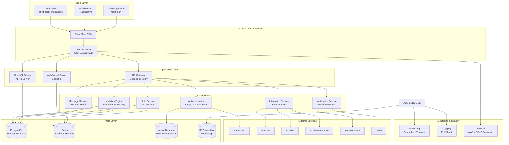
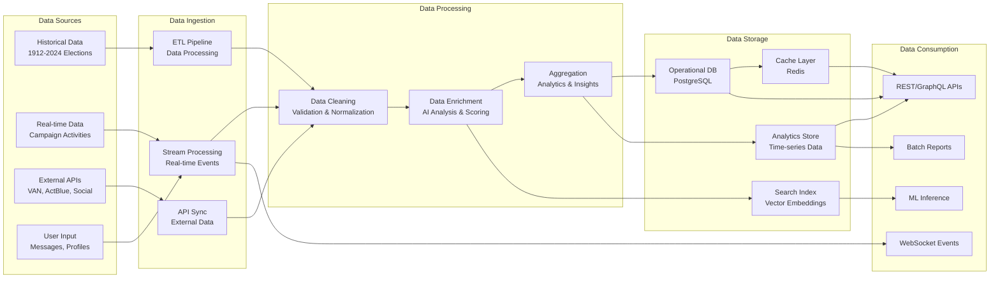
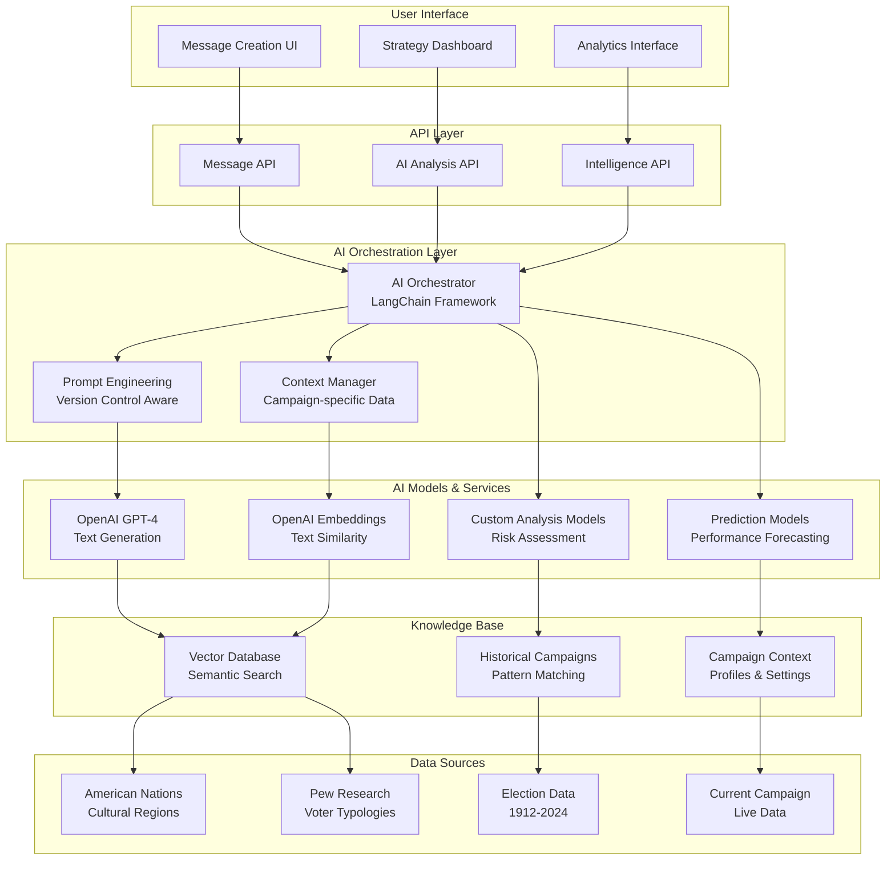
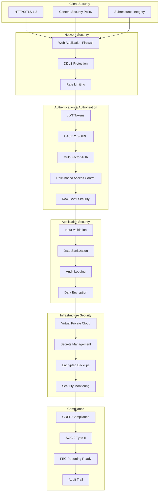
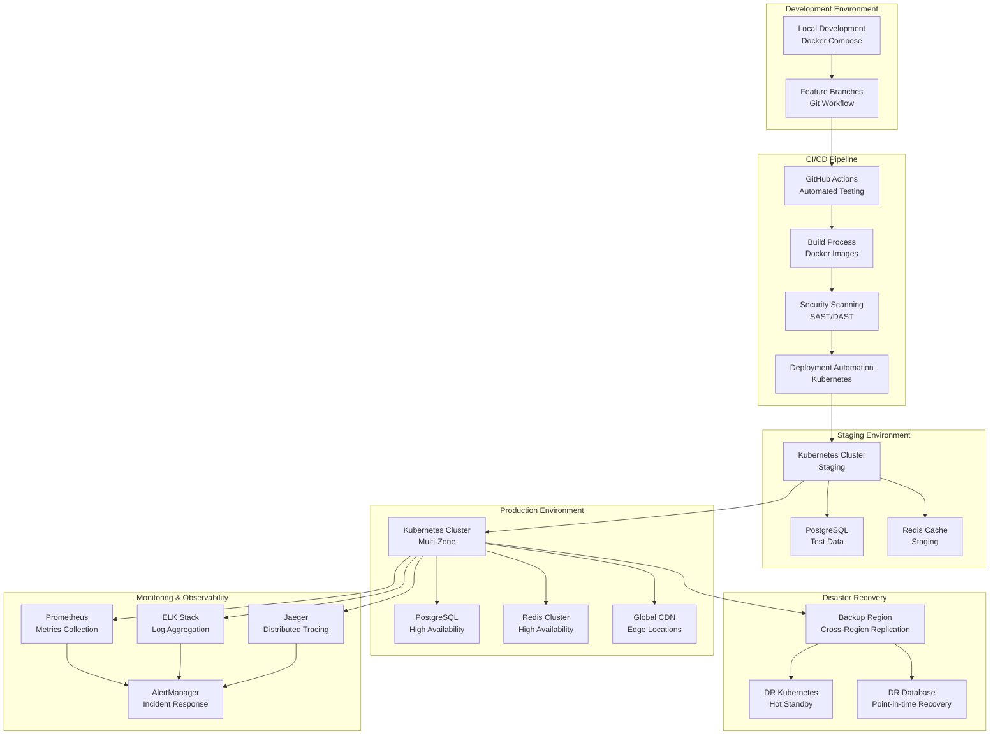
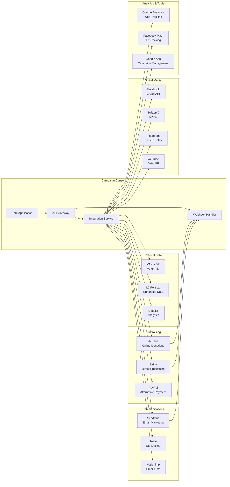
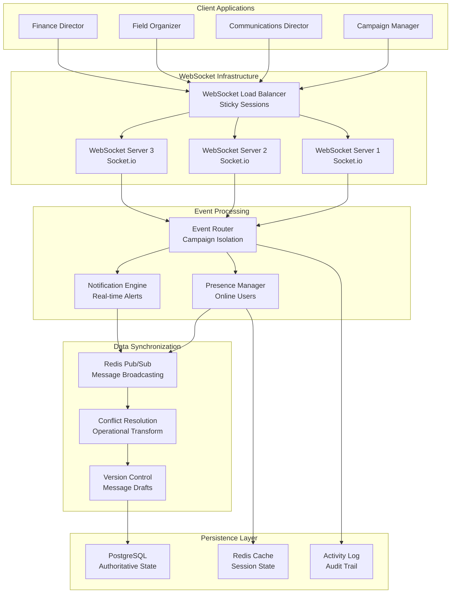
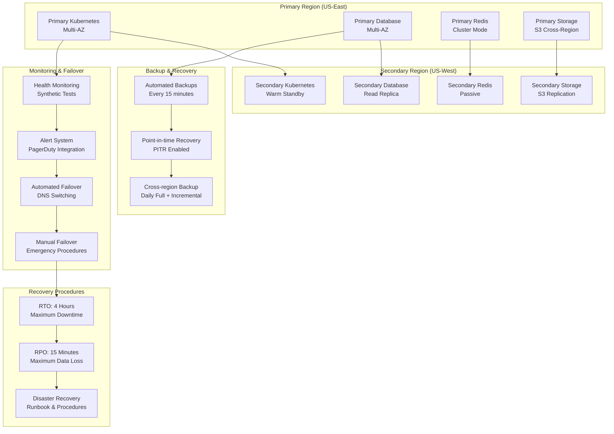
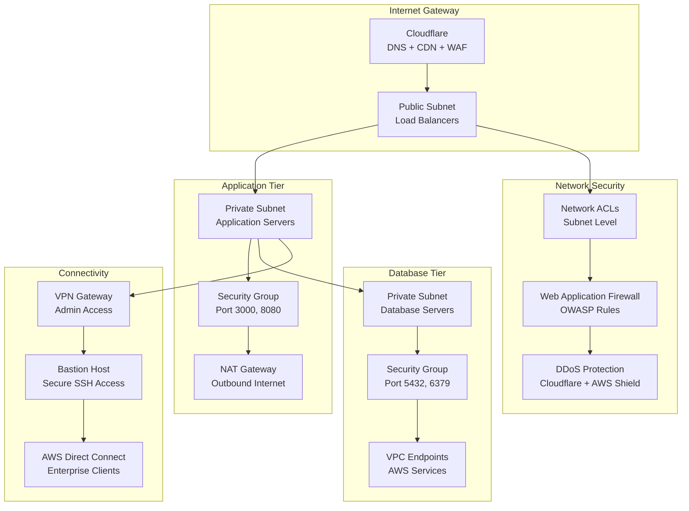

# System Architecture Document
## Akashic Intelligence Campaign Console

### 1. High-Level System Architecture

### 2. Data Flow Architecture

### 3. AI & ML Architecture

### 4. Security Architecture

### 5. Deployment Architecture

### 6. Integration Architecture

### 7. Real-time Collaboration Architecture

### 8. Performance & Scaling Architecture

```mermaid
graph TB
    subgraph "Load Distribution"
        DNS[DNS Load Balancing<br/>Geographic Routing]
        CDN[Global CDN<br/>Edge Caching]
        ALB[Application Load Balancer<br/>Auto Scaling]
    end
    
    subgraph "Application Tier Scaling"
        AUTO_SCALE[Auto Scaling Groups<br/>CPU/Memory Based]
        HORIZONTAL[Horizontal Pod Autoscaler<br/>Kubernetes]
        VERTICAL[Vertical Pod Autoscaler<br/>Resource Optimization]
    end
    
    subgraph "Database Scaling"
        READ_REPLICAS[Read Replicas<br/>Geographic Distribution]
        CONNECTION_POOL[Connection Pooling<br/>PgBouncer]
        PARTITIONING[Table Partitioning<br/>Time-based]
    end
    
    subgraph "Caching Strategy"
        L1_CACHE[L1 Cache<br/>Application Memory]
        L2_CACHE[L2 Cache<br/>Redis Cluster]
        L3_CACHE[L3 Cache<br/>CDN Edge]
    end
    
    subgraph "Asynchronous Processing"
        QUEUE[Message Queues<br/>BullMQ/Redis]
        WORKERS[Background Workers<br/>CPU Intensive Tasks]
        BATCH[Batch Processing<br/>Scheduled Jobs]
    end
    
    subgraph "Performance Monitoring"
        APM[Application Performance<br/>New Relic/DataDog]
        METRICS[Custom Metrics<br/>Prometheus]
        PROFILING[Performance Profiling<br/>CPU/Memory]
    end
    
    DNS --> CDN
    CDN --> ALB
    
    ALB --> AUTO_SCALE
    AUTO_SCALE --> HORIZONTAL
    HORIZONTAL --> VERTICAL
    
    VERTICAL --> READ_REPLICAS
    READ_REPLICAS --> CONNECTION_POOL
    CONNECTION_POOL --> PARTITIONING
    
    PARTITIONING --> L1_CACHE
    L1_CACHE --> L2_CACHE
    L2_CACHE --> L3_CACHE
    
    L3_CACHE --> QUEUE
    QUEUE --> WORKERS
    WORKERS --> BATCH
    
    BATCH --> APM
    APM --> METRICS
    METRICS --> PROFILING
```

### 9. Disaster Recovery Architecture

### 10. Network Architecture

